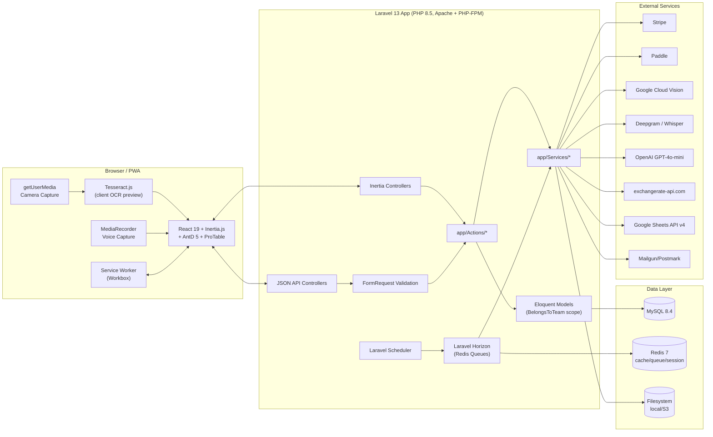
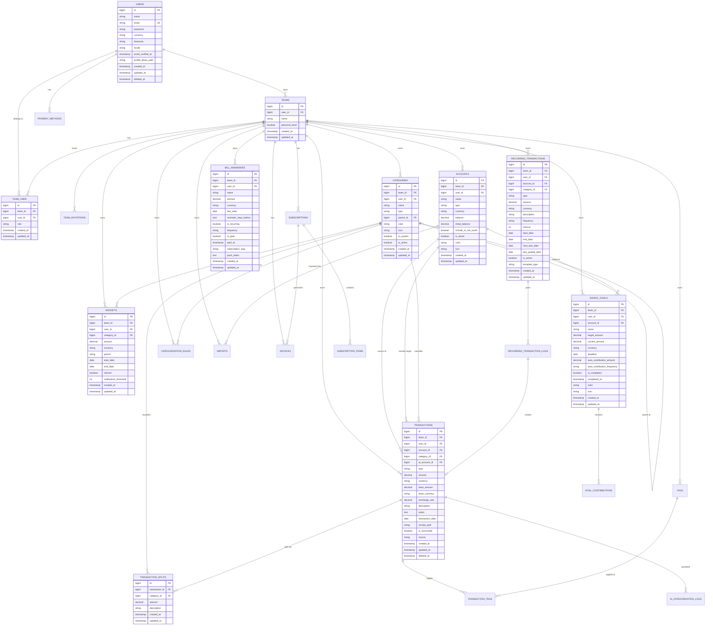

# Personal Finance Tracker SaaS — Implementation Plan

## Goal

Build a production-ready, multi-tenant Personal Finance Tracker SaaS as an installable, offline-capable Progressive Web App. Users track transactions across multiple accounts and currencies via three input methods (manual form, photo receipt OCR, voice), get AI-assisted categorization, budgets, recurring transactions, bank import, saving goals, bill reminders, rich reports, and export (PDF/CSV/OFX/Google Sheets). Billing is subscription-based via Stripe (primary) with Paddle as an international fallback.

This plan is written for Iwan (CPA, ERP developer, 15+ years experience) building on the same stack/conventions used in `sarang-erp-laravel`, `hotel-resort-erp`, `daily-production`, and `stock-alert`: Laravel + Inertia + React + AntD, dark mode default, phase-by-phase delivery.

## Architecture



## Tech Stack Summary

| Layer | Choice |
|---|---|
| Backend | Laravel 13 (PHP 8.5) |
| Frontend | React 19 + Inertia.js (CSR) + Ant Design 5 + `@ant-design/pro-table` + `@ant-design/pro-components` |
| Database | MySQL 8.4 |
| PWA | Workbox via `vite-plugin-pwa`, Web App Manifest |
| Auth | Laravel Sanctum (SPA, cookie-based) |
| Billing | Stripe (primary) via Laravel Cashier, Paddle (fallback) via Cashier Paddle |
| OCR | Tesseract.js (client preview) + Google Cloud Vision API (server, queued) |
| Voice/STT | MediaRecorder API + Deepgram / OpenAI Whisper |
| NLP Parsing | OpenAI GPT-4o-mini |
| AI Categorization | OpenAI embeddings + rules engine fallback |
| Queue | Laravel Horizon (Redis) |
| File Storage | Laravel Filesystem (local dev / S3-compatible prod) |
| PDF Export | Spatie Browsershot (primary), DomPDF fallback |
| Exchange Rates | exchangerate-api.com |
| CSV/OFX | Custom parser + `asika/adata-ofx`/hand-rolled OFX SGML parser |
| Google Sheets | `google/apiclient` (Sheets API v4) |
| Deployment | Ubuntu 26.04, Apache reverse proxy → PHP-FPM, Tailscale, Supervisor, GitHub Actions CI/CD |

Guiding principles applied throughout every phase: **DRY** (shared Actions/Services/Traits, no duplicated query logic), **YAGNI** (no speculative abstraction — e.g. no ML training pipeline until Phase 10, no multi-region until asked), **TDD** (write the failing Feature/Unit test before implementing the Action/Controller in every task marked `[TDD]`).

---

## Section 1: Application Overview & Executive Summary

**Product:** A multi-tenant, subscription-based Personal Finance Tracker delivered as an installable PWA (add-to-home-screen, offline transaction viewing, push notifications for bills/budgets).

**Target users:** Individuals and households who want to track personal finances across multiple bank accounts, credit cards, and currencies without spreadsheets.

**Key differentiators:**
1. Three transaction input modes — manual, photo receipt OCR, voice — reducing entry friction to near-zero.
2. AI auto-categorization that learns from the user's own correction history.
3. True offline-first PWA behavior with background sync.
4. Family/team shared household finances (not just single-user).

**Tenancy model:** Every finance record belongs to a `team_id`. A user's "personal team" is auto-created at registration (same pattern as Jetstream), and users can create/join additional teams for shared household finances. All queries are scoped via a global `BelongsToTeam` Eloquent scope + middleware that resolves "current team" from the session.

---

## Section 2: Core Features (Reference)

The 13 features below are the source of truth for scope. Each is fully broken into tasks in **Section 13 (Implementation Phases)** — this section is the feature reference/spec, not a task list.

1. **Multi-tenant SaaS** — registration/login (Sanctum SPA), email verification, password reset, 2FA (TOTP via `pragmarx/google2fa`), subscription tiers (Free/Pro), Stripe Checkout + Customer Portal with Paddle fallback, team/family accounts.
2. **Transaction Input Methods** — Photo OCR (getUserMedia → Tesseract.js preview → Google Vision queue job), Voice (MediaRecorder → Deepgram/Whisper → GPT-4o-mini extraction), Manual quick-add with autocomplete/prediction.
3. **Dashboard** — income/expense summary cards, net worth trend, recent transactions, budget gauges, upcoming recurring, saving goals progress.
4. **Transaction Management** — full CRUD via ProTable (server pagination/sort/filter), bulk edit/categorize/delete, transfers, splits.
5. **Budget Tracking** — per-category monthly budgets, progress bars, 80%/100% alerts, rollover, history.
6. **Recurring Transactions** — daily/weekly/monthly/yearly/custom schedules, auto-post via scheduler, templates, 30-day upcoming preview, pause/skip/edit.
7. **Bank Import** — CSV column-mapping wizard, OFX/QFX import, dedup, preview, auto-categorize on import.
8. **Reports & Charts** — spending by category, income vs expense trend, YoY, monthly summary, custom range, PDF export.
9. **Multi-Currency** — per-account currency, live FX rates, base-currency display, historical rates, transfer conversion.
10. **Saving Goals** — target/current amount, deadline, progress bar, linked account, auto-contribution, completion celebration.
11. **Bill Reminders** — push notifications, configurable lead time, click-to-open, email fallback.
12. **Export** — PDF (monthly/annual/custom), Google Sheets sync, CSV, OFX.
13. **AI Auto-Categorization** — ML/embedding-based prediction trained on user history, confidence score, batch categorize, rules-based fallback.

---

## Section 3: Database Schema

### Entity Relationship Diagram



### Table Definitions by Domain

**Identity & Multi-tenancy**

- `users` — id, name, email (unique), password, currency (default `USD`), timezone, locale, email_verified_at, profile_photo_path, remember_token, timestamps, `deleted_at` (soft delete)
- `teams` — id, user_id (owner, FK → users, cascade on delete), name, personal_team (bool), timestamps
- `team_user` — id, team_id (FK cascade), user_id (FK cascade), role (`owner`|`admin`|`member`), timestamps; unique(`team_id`,`user_id`)
- `team_invitations` — id, team_id (FK cascade), email, role, token (unique), timestamps

**Subscription & Billing**

- `subscriptions` — id, user_id (nullable FK), team_id (FK cascade), name, stripe_id (nullable, unique), paddle_id (nullable, unique), stripe_status, paddle_status, stripe_price, paddle_price, quantity, trial_ends_at, ends_at, timestamps
- `subscription_items` — id, subscription_id (FK cascade), stripe_id (unique), paddle_id (unique), stripe_product, stripe_price, quantity, timestamps
- `payment_methods` — id, user_id (FK cascade), stripe_id, paddle_id, pm_type, card_last_four, card_brand, is_default (bool), timestamps
- `invoices` — id, team_id (FK cascade), subscription_id (nullable FK), stripe_id, paddle_id, amount (decimal 12,2), currency, status, invoice_pdf (string path), timestamps

**Core Finance**

- `accounts` — id, team_id (FK cascade), user_id (FK), name, type (enum: `checking`,`savings`,`credit_card`,`cash`,`investment`), currency (char 3), balance (decimal 15,2), initial_balance (decimal 15,2), include_in_net_worth (bool default true), is_active (bool default true), color, icon, timestamps
- `categories` — id, team_id (FK cascade), user_id (nullable FK — null for system defaults), name, type (enum: `income`,`expense`), parent_id (nullable, self-FK), color, icon, is_system (bool), is_active (bool default true), timestamps
- `tags` — id, team_id (FK cascade), name, color, timestamps; unique(`team_id`,`name`)
- `transactions` — id, team_id (FK cascade), user_id (FK), account_id (FK), category_id (nullable FK, `nullOnDelete`), to_account_id (nullable FK → accounts, for transfers), type (enum: `income`,`expense`,`transfer`), amount (decimal 15,2), currency (char 3), base_amount (decimal 15,2), base_currency (char 3), exchange_rate (decimal 15,6, default 1), description, notes (text nullable), transaction_date (date), receipt_path (nullable), is_reconciled (bool default false), source (enum: `manual`,`ocr`,`voice`,`import`,`recurring`), timestamps, `deleted_at`
- `transaction_splits` — id, transaction_id (FK cascade), category_id (FK), amount (decimal 15,2), description (nullable), timestamps
- `transaction_tags` — id, transaction_id (FK cascade), tag_id (FK cascade), timestamps (created_at only); unique(`transaction_id`,`tag_id`)

**Budgets**

- `budgets` — id, team_id (FK cascade), user_id (FK), category_id (FK), amount (decimal 15,2), currency, period (enum: `monthly`,`yearly`,`custom`), start_date, end_date (nullable), rollover (bool default false), notification_threshold (tinyint default 80), timestamps; unique(`team_id`,`category_id`,`start_date`)

**Recurring**

- `recurring_transactions` — id, team_id (FK cascade), user_id (FK), account_id (FK), category_id (nullable FK), type (enum), amount (decimal 15,2), currency, description, frequency (enum: `daily`,`weekly`,`monthly`,`yearly`,`custom`), interval (int default 1), start_date, end_date (nullable), next_due_date, last_posted_date (nullable), is_active (bool default true), template_type (enum: `subscription`,`bill`,`salary`,`rent`,`custom`), timestamps
- `recurring_transaction_logs` — id, recurring_transaction_id (FK cascade), transaction_id (nullable FK, `nullOnDelete`), posted_at (nullable), was_skipped (bool default false), skip_reason (nullable), created_at

**Goals**

- `saving_goals` — id, team_id (FK cascade), user_id (FK), account_id (nullable FK), name, target_amount (decimal 15,2), current_amount (decimal 15,2 default 0), currency, deadline (nullable date), auto_contribution_amount (nullable decimal), auto_contribution_frequency (nullable enum), is_completed (bool default false), completed_at (nullable), color, icon, timestamps
- `goal_contributions` — id, saving_goal_id (FK cascade), amount (decimal 15,2), contributed_at (date), note (nullable), created_at

**Reminders**

- `bill_reminders` — id, team_id (FK cascade), user_id (FK), name, amount (decimal 15,2), currency, due_date, reminder_days_before (json, e.g. `[1,3,7]`), is_recurring (bool), frequency (nullable enum), is_paid (bool default false), paid_at (nullable), subscription_slug (nullable), push_token (text nullable), timestamps

**AI / Meta**

- `categorization_rules` — id, team_id (FK cascade), user_id (FK), pattern (string — keyword or regex), category_id (FK cascade), confidence (decimal 4,3 default 1.0), source (enum: `manual`,`ai_trained`), timestamps
- `ai_categorization_logs` — id, transaction_id (FK cascade), predicted_category_id (nullable FK, `nullOnDelete`), confidence (decimal 4,3), actual_category_id (nullable FK), was_correct (nullable bool), model_version (string), created_at

**Audit**

- `audit_logs` — id, team_id (FK cascade), user_id (nullable FK), auditable_type (string), auditable_id (unsigned bigint), event (enum: `created`,`updated`,`deleted`), old_values (json nullable), new_values (json nullable), created_at. Implemented via a lightweight custom `Auditable` trait + model observer (YAGNI: avoid pulling in `spatie/laravel-activitylog` unless richer UI is needed later).

**Import**

- `imports` — id, team_id (FK cascade), user_id (FK), account_id (FK), file_path, file_type (enum: `csv`,`ofx`), status (enum: `pending`,`processing`,`completed`,`failed`), total_rows (int default 0), imported_rows (int default 0), skipped_rows (int default 0), error_log (json nullable), timestamps

### Cross-cutting Rules

- Every tenant table has `team_id` with an FK constraint `cascadeOnDelete()` to `teams`.
- Soft deletes (`deleted_at`) on: `users`, `transactions`. (Not needed on lookup/config tables per YAGNI — they use hard delete with FK `restrictOnDelete`/`nullOnDelete` as appropriate.)
- All tables have `created_at`/`updated_at` except pure log tables (`created_at` only).

### Required Indexes

```php
// transactions
$table->index(['team_id', 'transaction_date']);
$table->index(['account_id', 'transaction_date']);
$table->index(['category_id', 'team_id']);
$table->index(['user_id', 'created_at']);

// recurring_transactions
$table->index(['next_due_date', 'is_active']);

// budgets
$table->index(['team_id', 'category_id', 'start_date']);

// bill_reminders
$table->index(['due_date', 'is_paid']);

// imports
$table->index(['team_id', 'status']);

// ai_categorization_logs
$table->index(['transaction_id']);

// audit_logs
$table->index(['team_id', 'auditable_type', 'auditable_id']);
```

---

## Section 4: API Routes Structure

All routes below live under `routes/api.php` (Sanctum SPA `auth:sanctum` + `verified` middleware group) unless noted. Route names use kebab-case; controllers grouped by domain under `app/Http/Controllers/Api/`.

```
/api/auth/*                (routes/auth.php — Sanctum SPA, some public)
  POST   /register
  POST   /login
  POST   /logout
  POST   /forgot-password
  POST   /reset-password
  POST   /email/verification-notification
  GET    /verify-email/{id}/{hash}
  GET    /user
  PUT    /user/profile
  PUT    /user/password

/api/teams/*
  GET    /teams
  POST   /teams
  PUT    /teams/{team}
  DELETE /teams/{team}
  POST   /teams/{team}/invitations
  DELETE /teams/{team}/members/{user}
  PUT    /teams/{team}/members/{user}/role
  POST   /teams/switch/{team}

/api/billing/*
  GET    /plans
  POST   /subscribe
  POST   /checkout
  GET    /portal
  GET    /invoices
  GET    /invoices/{invoice}/pdf
  POST   /webhook/stripe          (no auth middleware — signature verified)
  POST   /webhook/paddle          (no auth middleware — signature verified)

/api/accounts/*
  GET|POST /accounts
  GET|PUT|DELETE /accounts/{account}
  PUT    /accounts/{account}/reconcile

/api/categories/*
  GET|POST /categories
  PUT|DELETE /categories/{category}
  PUT    /categories/reorder

/api/tags/*
  GET|POST /tags
  PUT|DELETE /tags/{tag}

/api/transactions/*
  GET|POST /transactions
  GET|PUT|DELETE /transactions/{transaction}
  POST   /transactions/bulk
  POST   /transactions/{transaction}/splits
  DELETE /transactions/{transaction}/splits/{split}
  POST   /transactions/ocr
  POST   /transactions/ocr/{ocrJob}/status
  POST   /transactions/voice
  POST   /transactions/voice/{voiceJob}/status
  POST   /transactions/suggestions

/api/budgets/*
  GET|POST /budgets
  PUT|DELETE /budgets/{budget}
  GET    /budgets/alerts

/api/recurring-transactions/*
  GET|POST /recurring-transactions
  PUT|DELETE /recurring-transactions/{recurring}
  POST   /recurring-transactions/{recurring}/skip
  POST   /recurring-transactions/{recurring}/post-now
  GET    /recurring-transactions/upcoming

/api/imports/*
  GET    /imports
  POST   /imports/upload
  POST   /imports/{import}/process
  GET    /imports/{import}/preview
  POST   /imports/{import}/confirm
  DELETE /imports/{import}

/api/reports/*
  GET    /reports/spending-by-category
  GET    /reports/income-vs-expense
  GET    /reports/trend
  GET    /reports/year-over-year
  GET    /reports/monthly-summary
  GET    /reports/net-worth

/api/goals/*
  GET|POST /saving-goals
  PUT|DELETE /saving-goals/{goal}
  POST   /saving-goals/{goal}/contributions

/api/reminders/*
  GET|POST /bill-reminders
  PUT|DELETE /bill-reminders/{reminder}
  PUT    /bill-reminders/{reminder}/paid
  POST   /bill-reminders/subscribe

/api/export/*
  GET    /export/pdf
  GET    /export/csv
  GET    /export/ofx
  POST   /export/google-sheets
  GET    /export/google-sheets/status

/api/dashboard/*
  GET    /dashboard/summary

/api/ai/*
  POST   /categorize
  POST   /categorize/batch
  GET|POST /categorization-rules
  DELETE /categorization-rules/{rule}
  GET    /categorization-accuracy

/api/exchange-rates/*
  GET    /rates
  POST   /convert
```

**Response envelope convention** (`app/Http/Resources/`):

```json
{
  "data": {},
  "message": "string|null",
  "errors": {},
  "meta": { "current_page": 1, "per_page": 20, "total": 100 }
}
```

Implemented once via `app/Http/Responses/ApiResponse.php` helper + a base `ApiController` trait — never duplicated per controller (DRY).

---

## Section 5: React Component Tree

```
resources/js/
├── app.jsx
├── Components/
│   ├── Layout/
│   │   ├── AppLayout.jsx
│   │   ├── GuestLayout.jsx
│   │   ├── DashboardLayout.jsx
│   │   ├── Sidebar.jsx
│   │   ├── TopHeader.jsx
│   │   ├── MobileNav.jsx
│   │   └── DarkModeToggle.jsx
│   ├── Shared/
│   │   ├── AmountDisplay.jsx
│   │   ├── CategoryBadge.jsx
│   │   ├── CategorySelect.jsx
│   │   ├── AccountSelect.jsx
│   │   ├── CurrencySelect.jsx
│   │   ├── DateRangePicker.jsx
│   │   ├── EmptyState.jsx
│   │   ├── LoadingSpinner.jsx
│   │   ├── ConfirmModal.jsx
│   │   ├── ColorPicker.jsx
│   │   ├── IconPicker.jsx
│   │   ├── ProgressBar.jsx
│   │   └── PushNotificationPrompt.jsx
│   ├── Transactions/
│   │   ├── TransactionTable.jsx
│   │   ├── TransactionForm.jsx
│   │   ├── QuickAddFAB.jsx
│   │   ├── QuickAddModal.jsx
│   │   ├── ReceiptCapture.jsx
│   │   ├── OCRPreview.jsx
│   │   ├── VoiceInput.jsx
│   │   ├── VoicePreview.jsx
│   │   ├── SplitTransaction.jsx
│   │   ├── BulkActions.jsx
│   │   ├── TransactionDetail.jsx
│   │   └── MerchantAutocomplete.jsx
│   ├── Dashboard/
│   │   ├── DashboardWidgets.jsx
│   │   ├── IncomeExpenseCard.jsx
│   │   ├── NetWorthChart.jsx
│   │   ├── RecentTransactions.jsx
│   │   ├── BudgetGauges.jsx
│   │   ├── UpcomingRecurring.jsx
│   │   └── SavingGoalsWidget.jsx
│   ├── Budgets/
│   │   ├── BudgetList.jsx
│   │   ├── BudgetForm.jsx
│   │   ├── BudgetProgressBar.jsx
│   │   └── BudgetAlert.jsx
│   ├── Accounts/
│   │   ├── AccountList.jsx
│   │   ├── AccountForm.jsx
│   │   └── AccountBalance.jsx
│   ├── Imports/
│   │   ├── ImportUploader.jsx
│   │   ├── CSVColumnMapper.jsx
│   │   ├── ImportPreview.jsx
│   │   └── ImportProgress.jsx
│   ├── Reports/
│   │   ├── ReportBuilder.jsx
│   │   ├── SpendingByCategory.jsx
│   │   ├── IncomeExpenseTrend.jsx
│   │   ├── YearOverYear.jsx
│   │   └── ReportExport.jsx
│   ├── Goals/
│   │   ├── GoalList.jsx
│   │   ├── GoalForm.jsx
│   │   └── GoalProgress.jsx
│   ├── Reminders/
│   │   ├── ReminderList.jsx
│   │   ├── ReminderForm.jsx
│   │   └── NotificationPermission.jsx
│   ├── Settings/
│   │   ├── ProfileSettings.jsx
│   │   ├── TeamSettings.jsx
│   │   ├── BillingSettings.jsx
│   │   ├── CategorySettings.jsx
│   │   ├── TagSettings.jsx
│   │   ├── NotificationSettings.jsx
│   │   └── AISettings.jsx
│   └── PWA/
│       ├── InstallPrompt.jsx
│       └── OfflineIndicator.jsx
├── Pages/
│   ├── Dashboard.jsx
│   ├── Transactions/
│   │   ├── Index.jsx
│   │   └── Show.jsx
│   ├── Budgets/Index.jsx
│   ├── Accounts/Index.jsx
│   ├── Imports/
│   │   ├── Index.jsx
│   │   └── Create.jsx
│   ├── Reports/Index.jsx
│   ├── Goals/Index.jsx
│   ├── Reminders/Index.jsx
│   ├── Settings/
│   │   ├── Profile.jsx
│   │   ├── Team.jsx
│   │   ├── Billing.jsx
│   │   ├── Categories.jsx
│   │   └── AI.jsx
│   └── Auth/
│       ├── Login.jsx
│       ├── Register.jsx
│       ├── ForgotPassword.jsx
│       └── ResetPassword.jsx
├── Hooks/
│   ├── useTeam.jsx
│   ├── useCurrency.jsx
│   ├── useMediaRecorder.jsx
│   ├── useCamera.jsx
│   ├── usePushNotifications.jsx
│   ├── useOfflineDetection.jsx
│   ├── useInfiniteScroll.jsx
│   └── useDashboardData.jsx
├── Contexts/
│   ├── TeamContext.jsx
│   ├── ThemeContext.jsx
│   └── CurrencyContext.jsx
├── Utils/
│   ├── formatCurrency.js
│   ├── dateHelpers.js
│   ├── api.js
│   └── swRegistration.js
├── Charts/
│   ├── PieChart.jsx
│   ├── LineChart.jsx
│   ├── BarChart.jsx
│   └── ProgressGauge.jsx
└── css/
    ├── app.css
    └── dark-mode.css
```

Charting library: **Recharts** (lighter weight than Chart.js for React, composes well with AntD's design tokens for dark mode theming).

---

## Section 6: PWA Service Worker Strategy

**Tooling:** `vite-plugin-pwa` (Workbox under the hood), configured in `vite.config.js`.

```js
// vite.config.js (relevant excerpt)
import { VitePWA } from 'vite-plugin-pwa';

export default defineConfig({
  plugins: [
    laravel({ input: ['resources/js/app.jsx', 'resources/css/app.css'], refresh: true }),
    react(),
    VitePWA({
      registerType: 'autoUpdate',
      strategies: 'injectManifest',
      srcDir: 'resources/js',
      filename: 'sw.js',
      manifest: {
        name: 'Personal Finance Tracker',
        short_name: 'FinTrack',
        description: 'Track income, expenses, budgets, and goals across every account.',
        theme_color: '#141414',
        background_color: '#141414',
        display: 'standalone',
        start_url: '/dashboard',
        icons: [
          { src: '/icons/icon-192.png', sizes: '192x192', type: 'image/png' },
          { src: '/icons/icon-512.png', sizes: '512x512', type: 'image/png' },
          { src: '/icons/icon-maskable-512.png', sizes: '512x512', type: 'image/png', purpose: 'maskable' },
        ],
      },
      injectManifest: { globPatterns: ['**/*.{js,css,html,png,svg,ico}'] },
    }),
  ],
});
```

```js
// resources/js/sw.js
import { precacheAndRoute } from 'workbox-precaching';
import { registerRoute } from 'workbox-routing';
import { NetworkFirst, CacheFirst, StaleWhileRevalidate } from 'workbox-strategies';
import { ExpirationPlugin } from 'workbox-expiration';
import { BackgroundSyncPlugin } from 'workbox-background-sync';

precacheAndRoute(self.__WB_MANIFEST);

registerRoute(
  ({ url }) => url.pathname.startsWith('/api/') && !url.pathname.includes('/transactions'),
  new NetworkFirst({ cacheName: 'api-cache', networkTimeoutSeconds: 5 })
);

registerRoute(
  ({ url }) => url.pathname.startsWith('/api/transactions'),
  new StaleWhileRevalidate({
    cacheName: 'transactions-cache',
    plugins: [new ExpirationPlugin({ maxEntries: 200, maxAgeSeconds: 86400 })],
  })
);

registerRoute(
  ({ request }) => ['style', 'script', 'font', 'image'].includes(request.destination),
  new CacheFirst({
    cacheName: 'static-assets',
    plugins: [new ExpirationPlugin({ maxEntries: 100, maxAgeSeconds: 30 * 86400 })],
  })
);

const bgSyncPlugin = new BackgroundSyncPlugin('transaction-queue', { maxRetentionTime: 24 * 60 });
registerRoute(
  ({ url, request }) => url.pathname === '/api/transactions' && request.method === 'POST',
  ({ event }) => fetch(event.request).catch(() => Promise.reject('offline')),
  'POST'
);

self.addEventListener('push', (event) => {
  const data = event.data.json();
  event.waitUntil(
    self.registration.showNotification(data.title, {
      body: data.body,
      icon: '/icons/icon-192.png',
      data: { url: data.url },
    })
  );
});

self.addEventListener('notificationclick', (event) => {
  event.notification.close();
  event.waitUntil(clients.openWindow(event.notification.data.url));
});
```

**Offline capabilities:** cached transaction list viewable offline (StaleWhileRevalidate); new transactions created offline are queued via Background Sync and replayed on reconnect; `OfflineIndicator.jsx` listens to `navigator.onLine` + `useOfflineDetection` hook to show a banner.

**Push notifications:** triggered server-side for bill reminders, budget threshold alerts, recurring-transaction-posted, and goal-milestone events, using `web-push` PHP library (`minishlink/web-push`) with VAPID keys stored in `.env`.

**Install prompt:** `InstallPrompt.jsx` listens for `beforeinstallprompt`, stores the event, and shows a custom AntD `Modal`/`Drawer` banner after the 3rd visit (visit count tracked in `localStorage`).

---

## Section 7: OCR Pipeline

```
Camera Capture (client):
  getUserMedia() → <video> element → canvas.drawImage() snapshot → Blob
  Optional: Tesseract.js quick client-side text preview (instant, low-accuracy)
  Compress via canvas (max 1600px, JPEG q=0.8) → POST /api/transactions/ocr (multipart)

Server Receipt Controller (ReceiptOcrController@store):
  Validate (image, max 8MB, mimes:jpg,jpeg,png,webp)
  Store to 'receipts' disk under pending/{team_id}/{uuid}.{ext}
  Create OcrJob-tracking row (id returned to client for polling) — reuse `imports`-style status pattern via a small `ocr_jobs` table (id, team_id, transaction_id nullable, file_path, status, result json, error, timestamps)
  Dispatch ProcessReceiptOcr::dispatch($ocrJob)->onQueue('receipts')
  Return 202 { data: { ocr_job_id } }

ProcessReceiptOcr Job (app/Jobs/ProcessReceiptOcr.php):
  Call GoogleVisionService::extractReceiptText($path) → DOCUMENT_TEXT_DETECTION
  Parse response via ReceiptParserService: merchant name (first prominent line),
    date (regex date patterns), total (largest currency-like amount near "total"/"amount due"),
    line items (best-effort table heuristic)
  Apply CategorizationRuleService::suggest($merchant, $description) for first-pass category
  Update ocr_jobs.status = 'completed', result = json_encode([...])
  On failure: status = 'failed', error = $e->getMessage()

Client polling (or Echo/websocket later — YAGNI for v1, poll every 2s up to 30s):
  GET /api/transactions/ocr/{ocrJob}/status → { status, result }
  OCRPreview.jsx renders extracted fields in an editable TransactionForm
  User confirms → POST /api/transactions (source: 'ocr', receipt_path from ocr_jobs.file_path)
  Move file from pending/ to receipts/{team_id}/{year}/{month}/{transaction_id}.{ext} in the transaction store Action
```

---

## Section 8: Voice Pipeline

```
Voice Recording (client, VoiceInput.jsx + useMediaRecorder hook):
  navigator.mediaDevices.getUserMedia({ audio: true })
  MediaRecorder(stream, { mimeType: 'audio/webm' }) → collect chunks → Blob on stop
  POST /api/transactions/voice (multipart, field: audio)

Server (VoiceTransactionController@store):
  Validate (audio, max 10MB, mimes:webm,ogg,wav)
  Store to 'voice-notes' disk temp path
  Create voice_jobs row (id, team_id, transaction_id nullable, file_path, status, transcript, result json, timestamps)
  Dispatch ProcessVoiceTransaction::dispatch($voiceJob)->onQueue('voice')
  Return 202 { data: { voice_job_id } }

ProcessVoiceTransaction Job:
  Step 1: DeepgramService::transcribe($path) → transcript string (fallback: OpenAiWhisperService)
  Step 2: OpenAiNlpService::extractTransaction($transcript) — structured prompt:
    """
    Extract a financial transaction from this text: "{transcript}"
    Return strict JSON: { amount, merchant, date, category, type, notes }
    Use null for unknown fields. type is one of income|expense.
    """
  Step 3: parse/validate JSON response (json_decode + schema check; retry once on malformed JSON)
  Update voice_jobs.status = 'completed', transcript, result
  Dispatch CleanupVoiceAudio::dispatch($voiceJob)->delay(now()->addHours(24))->onQueue('voice')

Client polling:
  GET /api/transactions/voice/{voiceJob}/status → { status, transcript, result }
  VoicePreview.jsx shows transcript + editable extracted fields
  User confirms → POST /api/transactions (source: 'voice')
```

---

## Section 9: File Storage Strategy

```
storage/
├── app/
│   ├── receipts/
│   │   ├── pending/{team_id}/{uuid}.{ext}
│   │   └── {team_id}/{year}/{month}/{transaction_id}.{ext}
│   ├── imports/
│   │   └── {team_id}/{import_id}.{ext}
│   ├── voice-notes/
│   │   ├── pending/{team_id}/{uuid}.webm
│   │   └── {team_id}/{year}/{month}/{transaction_id}.webm
│   ├── exports/
│   │   └── {team_id}/{year}/{month}/{report_type}_{timestamp}.pdf
│   └── avatars/
│       └── {user_id}.{ext}
```

```php
// config/filesystems.php additions
'disks' => [
    // ...
    'receipts' => [
        'driver' => env('RECEIPTS_DISK_DRIVER', 'local'),
        'root' => storage_path('app/receipts'),
        'visibility' => 'private',
        'throw' => true,
    ],
    'voice_notes' => [
        'driver' => env('VOICE_DISK_DRIVER', 'local'),
        'root' => storage_path('app/voice-notes'),
        'visibility' => 'private',
        'throw' => true,
    ],
    'exports' => [
        'driver' => env('EXPORTS_DISK_DRIVER', 'local'),
        'root' => storage_path('app/exports'),
        'visibility' => 'private',
        'throw' => true,
    ],
    's3' => [
        'driver' => 's3',
        'key' => env('AWS_ACCESS_KEY_ID'),
        'secret' => env('AWS_SECRET_ACCESS_KEY'),
        'region' => env('AWS_DEFAULT_REGION'),
        'bucket' => env('AWS_BUCKET'),
        'endpoint' => env('AWS_ENDPOINT'), // DigitalOcean Spaces endpoint in prod
        'visibility' => 'private',
    ],
],
```

All disks are **private**; files are served exclusively via `Storage::disk('receipts')->temporaryUrl($path, now()->addMinutes(10))` behind an authorized controller action (`ReceiptController@show`) that checks team ownership before generating the signed URL.

---

## Section 10: Queue Jobs

Laravel Horizon config (`config/horizon.php`) defines per-queue supervisors:

```php
'environments' => [
    'production' => [
        'supervisor-receipts' => ['connection' => 'redis', 'queue' => ['receipts'], 'balance' => 'auto', 'maxProcesses' => 3, 'tries' => 3],
        'supervisor-voice' => ['connection' => 'redis', 'queue' => ['voice'], 'balance' => 'auto', 'maxProcesses' => 3, 'tries' => 3],
        'supervisor-imports' => ['connection' => 'redis', 'queue' => ['imports'], 'balance' => 'auto', 'maxProcesses' => 2, 'tries' => 2],
        'supervisor-recurring' => ['connection' => 'redis', 'queue' => ['recurring'], 'balance' => 'simple', 'maxProcesses' => 1],
        'supervisor-exports' => ['connection' => 'redis', 'queue' => ['exports'], 'balance' => 'auto', 'maxProcesses' => 2],
        'supervisor-ai' => ['connection' => 'redis', 'queue' => ['ai'], 'balance' => 'auto', 'maxProcesses' => 2],
        'supervisor-notifications' => ['connection' => 'redis', 'queue' => ['notifications'], 'balance' => 'auto', 'maxProcesses' => 3, 'tries' => 3],
        'supervisor-exchange-rates' => ['connection' => 'redis', 'queue' => ['exchange-rates'], 'balance' => 'simple', 'maxProcesses' => 1],
    ],
],
```

| Queue | Jobs |
|---|---|
| `receipts` | `ProcessReceiptOcr`, `OptimizeReceiptImage` |
| `voice` | `ProcessVoiceTransaction`, `CleanupVoiceAudio` |
| `imports` | `ProcessCsvImport`, `ProcessOfxImport`, `AutoCategorizeImport` |
| `recurring` | `PostRecurringTransactions`, `SendBillReminders` |
| `exports` | `GeneratePdfReport`, `SyncGoogleSheets`, `GenerateCsvExport` |
| `ai` | `AutoCategorizeTransaction`, `TrainCategorizationModel`, `BatchAutoCategorize` |
| `notifications` | `SendPushNotification`, `SendEmailReminder` |
| `exchange-rates` | `FetchExchangeRates` |

Scheduler (`routes/console.php` in Laravel 11+/13 style — no `app/Console/Kernel.php`):

```php
use Illuminate\Support\Facades\Schedule;
use App\Jobs\PostRecurringTransactions;
use App\Jobs\SendBillReminders;
use App\Jobs\FetchExchangeRates;

Schedule::job(new PostRecurringTransactions)->dailyAt('00:05')->onOneServer();
Schedule::job(new SendBillReminders)->dailyAt('07:00')->onOneServer();
Schedule::job(new FetchExchangeRates)->dailyAt('01:00')->onOneServer();
```

---

## Section 11: Testing Strategy

```
Unit Tests (tests/Unit/):
  - Models: relationships, scopes (BelongsToTeam), accessors/casts (Money casting on transactions)
  - Actions/Services: CurrencyConverterService, ReceiptParserService, CategorizationRuleService
  - CSV/OFX parsers: CsvImportParser, OfxImportParser
  - Amount calculations: TransactionSplitService, TransferService

Feature Tests (tests/Feature/):
  - Every API endpoint: 200/201/422/403/404 paths
  - Team isolation: user in Team A cannot read/write Team B's records
  - Rate limiting on OCR/voice/AI endpoints
  - Subscription gating: Free tier blocked from Pro-only endpoints (e.g. AI categorize, Google Sheets sync)
  - File uploads: receipts, CSV/OFX imports, voice audio
  - Export generation: PDF/CSV/OFX byte-level smoke assertions
  - Webhooks: Stripe/Paddle signature verification + status transitions

Integration Tests (tests/Feature/Integration/):
  - OCR pipeline end-to-end with GoogleVisionService faked via Http::fake()
  - Voice pipeline end-to-end with Deepgram/OpenAI faked via Http::fake()
  - Import flow: upload → preview → confirm → transactions created
  - Subscription lifecycle: register → checkout → webhook → active → cancel
  - Recurring transaction posting via artisan schedule:run
  - Push notification dispatch (mock web-push transport)

Browser Tests (Laravel Dusk):
  - Registration/login flow
  - Transaction CRUD via ProTable
  - Camera capture flow (mock getUserMedia via Dusk JS injection)
  - Voice recording flow (mock MediaRecorder)
  - PWA install prompt visibility
  - Offline banner appears when navigator.onLine = false
  - Dark mode toggle persists across reload

Test data:
  - Model factories (`database/factories/*Factory.php`) with realistic Faker data per domain
  - `RefreshDatabase` trait for all Feature tests; SQLite in-memory for speed where no MySQL-specific SQL is used, otherwise a dedicated `mysql_testing` connection
  - `DatabaseTransactions` reserved for slower Dusk-adjacent suites where full refresh is too costly

TDD workflow per task: write the failing test in the same task's file path list before/alongside the implementation file, run `php artisan test --filter=...`, then implement until green.
```

---

## Section 12: Deployment Architecture

```
Production Environment:
  - Ubuntu 26.04 VPS
  - Apache 2.4 (mod_proxy_fcgi) reverse proxy → PHP-FPM 8.5
  - MySQL 8.4
  - Redis 7 (cache, queue, session)
  - Laravel Horizon under Supervisor
  - Tailscale for private admin/SSH access
  - Let's Encrypt SSL via certbot (apache plugin, auto-renew via systemd timer)

Deployment Flow:
  1. GitHub Actions CI on push to main: composer install --no-dev is NOT run in CI (full dev deps for tests) → phpunit/pest suite + `npm ci && npm run build` smoke build
  2. On CI green + manual approval (or auto on main): SSH deploy step (or Deployer `dep deploy`) runs on the VPS:
     - git pull origin main
     - composer install --no-dev --optimize-autoloader
     - npm ci && npm run build
     - php artisan migrate --force
     - php artisan config:cache
     - php artisan route:cache
     - php artisan view:cache
     - php artisan horizon:terminate   (Supervisor auto-restarts worker)
     - php artisan queue:restart

Services (Supervisor-managed, /etc/supervisor/conf.d/):
  - laravel-horizon.conf → php artisan horizon
  - Cron: * * * * * cd /var/www/personal-finance && php artisan schedule:run >> /dev/null 2>&1

External Services:
  - Stripe / Paddle: billing
  - Google Cloud Vision: OCR
  - Deepgram / Whisper: STT
  - OpenAI: NLP parsing + AI categorization
  - exchangerate-api.com: FX rates
  - Google Sheets API v4: sheet sync
  - Mailgun/Postmark: transactional email

Monitoring:
  - Laravel Telescope on staging/local only (excluded from production via APP_ENV guard in AppServiceProvider)
  - Sentry (laravel/sentry) for production error tracking
  - Horizon dashboard (`/horizon`, gated behind `HorizonServiceProvider::gate()` — team owners only)
  - `/up` health-check endpoint (Laravel 11+ built-in) monitored externally (e.g. UptimeRobot)
```

---

## Section 13: Implementation Phases

Each phase lists bite-sized tasks (2–5 minutes each) with exact file paths and, where non-trivial, complete code. Principles: **DRY** (shared traits/Actions), **YAGNI** (skip anything not required by the current phase's feature), **TDD** (test file precedes/accompanies implementation for every task marked `[TDD]`).

### Phase 1 — Project Scaffold + Auth + Multi-tenant

1. Scaffold project: `composer create-project laravel/laravel personal-finance "13.*"` in `/home/deahermes/personal-finance`.
2. Configure `.env`: `DB_CONNECTION=mysql`, `DB_DATABASE=personal_finance`, `QUEUE_CONNECTION=redis`, `CACHE_STORE=redis`, `SESSION_DRIVER=redis`.
3. Install Inertia server-side: `composer require inertiajs/inertia-laravel` → `php artisan inertia:middleware` (registers in `bootstrap/app.php`).
4. Install frontend deps: `npm install @inertiajs/react react react-dom antd @ant-design/pro-components @ant-design/pro-table recharts dayjs`.
5. Install Laravel Sanctum: `composer require laravel/sanctum` → `php artisan vendor:publish --provider="Laravel\Sanctum\SanctumServiceProvider"` → `php artisan migrate`.
6. Configure `bootstrap/app.php` to add `EnsureFrontendRequestsAreStateful` + `HandleInertiaRequests` to the `web` middleware group.
7. `[TDD]` Write `tests/Feature/Auth/RegistrationTest.php` asserting a new user + personal team are created on register.
8. Generate migration `create_teams_table`: `php artisan make:migration create_teams_table` at `database/migrations/`.
9. Generate migration `create_team_user_table` (alphabetical: `team_user`, not `user_team`) at `database/migrations/`.
10. Generate migration `create_team_invitations_table` at `database/migrations/`.
11. Add `currency`, `timezone`, `locale`, `profile_photo_path` columns to `users` via `php artisan make:migration add_profile_fields_to_users_table`.
12. `php artisan make:model Team -f` then `php artisan make:model TeamInvitation -f`; define `belongsTo(User::class)` / `hasMany` relationships in `app/Models/Team.php` and `app/Models/User.php` (`currentTeam()`, `allTeams()`, `ownedTeams()`).
13. `php artisan make:model TeamUser` (pivot) with `app/Models/TeamUser.php extends Pivot`, casts `role`.
14. Create `app/Actions/Teams/CreatePersonalTeamAction.php` — single-action class invoked from a `Registered` event listener.
15. `php artisan make:listener CreatePersonalTeamListener` — Laravel 11+ auto-listens since it's type-hinted to `Illuminate\Auth\Events\Registered`; no manual registration needed.

```php
// app/Listeners/CreatePersonalTeamListener.php
namespace App\Listeners;

use App\Actions\Teams\CreatePersonalTeamAction;
use Illuminate\Auth\Events\Registered;

class CreatePersonalTeamListener
{
    public function __construct(private CreatePersonalTeamAction $action) {}

    public function handle(Registered $event): void
    {
        $this->action->execute($event->user);
    }
}
```

```php
// app/Actions/Teams/CreatePersonalTeamAction.php
namespace App\Actions\Teams;

use App\Models\Team;
use App\Models\User;

class CreatePersonalTeamAction
{
    public function execute(User $user): Team
    {
        $team = $user->ownedTeams()->create([
            'name' => $user->name . "'s Team",
            'personal_team' => true,
        ]);

        $team->users()->attach($user, ['role' => 'owner']);
        $user->forceFill(['current_team_id' => $team->id])->save();

        return $team;
    }
}
```

16. Run migration, run `php artisan test --filter=RegistrationTest` until green.
17. `php artisan make:middleware EnsureTeamContext` at `app/Http/Middleware/EnsureTeamContext.php` — resolves current team from `$user->current_team_id`, aborts 403 if user has no team; register in `bootstrap/app.php` `withMiddleware`.
18. `php artisan make:model Concerns/BelongsToTeam` is not an artisan pattern — instead create trait manually at `app/Models/Concerns/BelongsToTeam.php` (trait file, not a "make" target):

```php
// app/Models/Concerns/BelongsToTeam.php
namespace App\Models\Concerns;

use App\Models\Team;
use Illuminate\Database\Eloquent\Builder;
use Illuminate\Support\Facades\Auth;

trait BelongsToTeam
{
    protected static function bootBelongsToTeam(): void
    {
        static::addGlobalScope('team', function (Builder $builder) {
            if (Auth::check() && Auth::user()->current_team_id) {
                $builder->where($builder->getModel()->getTable() . '.team_id', Auth::user()->current_team_id);
            }
        });

        static::creating(function ($model) {
            if (Auth::check() && empty($model->team_id)) {
                $model->team_id = Auth::user()->current_team_id;
            }
        });
    }

    public function team()
    {
        return $this->belongsTo(Team::class);
    }
}
```

19. `[TDD]` Write `tests/Unit/Models/Concerns/BelongsToTeamTest.php` asserting cross-team query isolation with two factories.
20. Enable 2FA: `composer require pragmarx/google2fa-laravel`; add `two_factor_secret`, `two_factor_recovery_codes` columns via `php artisan make:migration add_two_factor_columns_to_users_table`.
21. Build `resources/js/Pages/Auth/Register.jsx`, `Login.jsx`, `ForgotPassword.jsx`, `ResetPassword.jsx` using AntD `Form`/`Input`/`Button` inside `GuestLayout.jsx`.
22. `php artisan make:view` is Blade-only; for the single Inertia root view use `php artisan make:view app` to scaffold `resources/views/app.blade.php`, then edit it for the Inertia root `<div id="app" data-page="{{ json_encode($page) }}"></div>` + dark-mode `<html data-theme="dark">`.
23. Configure `app/Providers/AppServiceProvider.php` `boot()` to share `auth.user`, `current_team`, `flash` via `Inertia::share()`.
24. Set up `resources/js/Contexts/ThemeContext.jsx` defaulting to `dark`; wrap `app.jsx` root in AntD `ConfigProvider theme={{ algorithm: theme.darkAlgorithm }}`.
25. `php artisan make:controller Api/Auth/AuthenticatedSessionController` implementing login/logout per Sanctum SPA docs; add routes to `routes/auth.php`.
26. `[TDD]` Write `tests/Feature/Auth/TeamIsolationTest.php` hitting a dummy protected route to confirm `EnsureTeamContext` blocks teamless users.
27. Add Stripe/Paddle package placeholders: `composer require laravel/cashier laravel/cashier-paddle` (config only in this phase — billing logic deferred to later phase per YAGNI, but installing now avoids migration ordering issues since Cashier ships its own migrations).
28. Publish Cashier migrations, review and rename per naming conventions if needed, run `php artisan migrate`.
29. Verify with `php artisan test` full suite green before moving to Phase 2.

### Phase 2 — Accounts + Categories + Tags CRUD

1. `[TDD]` `tests/Feature/AccountTest.php` — CRUD + team isolation assertions.
2. `php artisan make:model Account -mfc --api` — generates model, migration, factory, API controller in one command.
3. Edit `database/migrations/xxxx_create_accounts_table.php` per Section 3 schema; add indexes.
4. Edit `app/Models/Account.php`: `use BelongsToTeam; protected $casts = ['balance' => 'decimal:2', 'initial_balance' => 'decimal:2', 'include_in_net_worth' => 'boolean', 'is_active' => 'boolean'];`
5. `php artisan make:factory AccountFactory` (already created by `-mfc`, just fill in realistic Faker fields: name, type enum, currency, balance).
6. `php artisan make:request StoreAccountRequest` and `UpdateAccountRequest` at `app/Http/Requests/`.
7. Implement `app/Http/Controllers/Api/AccountController.php` (index/store/show/update/destroy) using the FormRequests + `ApiResponse` helper.
8. Add `PUT /accounts/{account}/reconcile` route + `AccountController@reconcile` method that sets `balance` to a submitted reconciled amount and logs an adjustment transaction.
9. Register routes in `routes/api.php` under `Route::prefix('accounts')->group(...)`.
10. Run `php artisan test --filter=AccountTest` until green.
11. Repeat steps 1–10 pattern for `Category` (`php artisan make:model Category -mfc --api`), including self-referential `parent_id` and `is_system`/seed defaults via `database/seeders/CategorySeeder.php` (`php artisan make:seeder CategorySeeder`).
12. `[TDD]` `tests/Feature/CategoryTest.php` including hierarchy (`parent_id`) and reorder endpoint.
13. Add `PUT /categories/reorder` accepting an ordered array of IDs, persisting a `sort_order` column (add via migration `add_sort_order_to_categories_table`).
14. Repeat pattern for `Tag` (`php artisan make:model Tag -mfc --api`), simpler CRUD, unique per team.
15. `[TDD]` `tests/Feature/TagTest.php`.
16. Frontend: `resources/js/Components/Accounts/AccountList.jsx`, `AccountForm.jsx`, `AccountBalance.jsx` using AntD `Card`/`Modal`/`Form`.
17. Frontend: `resources/js/Pages/Accounts/Index.jsx` — Inertia page rendering `AccountList` with create/edit modal wiring.
18. Frontend: `resources/js/Components/Shared/CategorySelect.jsx`, `AccountSelect.jsx`, `CurrencySelect.jsx` — reusable AntD `Select` wrappers fetching via `Utils/api.js` Axios instance.
19. `resources/js/Utils/api.js` — Axios instance with `withCredentials: true`, base URL `/api`, response interceptor unwrapping `{ data }` envelope and normalizing errors.
20. `resources/js/Pages/Settings/Categories.jsx` — category management page with drag-to-reorder (AntD `Table` + `react-dnd` or simple up/down buttons — YAGNI: skip drag-and-drop library, use up/down arrow buttons calling `/categories/reorder`).
21. `resources/js/Components/Settings/TagSettings.jsx` — simple tag CRUD list.
22. Seed a default Chart of Categories (Groceries, Rent, Salary, Utilities, etc.) via `CategorySeeder`, run `php artisan db:seed --class=CategorySeeder`.
23. Verify full test suite green.

### Phase 3 — Transaction Management

1. `[TDD]` `tests/Feature/TransactionTest.php` — CRUD, team isolation, transfer creation (two linked rows or single row with `to_account_id`), split validation (splits sum == transaction amount).
2. `php artisan make:model Transaction -mfc --api`; edit migration per Section 3 schema (soft deletes, all indexes).
3. `php artisan make:model TransactionSplit -mf`; migration per schema.
4. `php artisan make:model TransactionTag -mf` (pivot-like model) for `transaction_tags`.
5. Define relationships in `app/Models/Transaction.php`: `belongsTo(Account::class)`, `belongsTo(Category::class)`, `belongsTo(Account::class, 'to_account_id')`, `hasMany(TransactionSplit::class)`, `belongsToMany(Tag::class, 'transaction_tags')`; add `use SoftDeletes, BelongsToTeam;` and a `Money`-style cast for `amount`/`base_amount`.
6. `php artisan make:enum TransactionType` (`app/Enums/TransactionType.php`, backed string enum: `Income`, `Expense`, `Transfer`). Repeat for `AccountType`, `Frequency`, `SubscriptionTier` (used later) at `app/Enums/`.
7. `php artisan make:request StoreTransactionRequest` / `UpdateTransactionRequest` — validate amount, currency (3-letter), type enum, conditional `to_account_id` required when `type=transfer`.
8. Create `app/Actions/Transactions/CreateTransactionAction.php` — single-action encapsulating: currency conversion (via `CurrencyConverterService`), balance update on the account(s), split creation, tag sync.

```php
// app/Actions/Transactions/CreateTransactionAction.php
namespace App\Actions\Transactions;

use App\Models\Transaction;
use App\Services\CurrencyConverterService;
use Illuminate\Support\Facades\DB;

class CreateTransactionAction
{
    public function __construct(private CurrencyConverterService $converter) {}

    public function execute(array $data): Transaction
    {
        return DB::transaction(function () use ($data) {
            $baseCurrency = auth()->user()->currency;
            $rate = $this->converter->rateFor($data['currency'], $baseCurrency, $data['transaction_date']);

            $transaction = Transaction::create([
                ...$data,
                'base_currency' => $baseCurrency,
                'base_amount' => round($data['amount'] * $rate, 2),
                'exchange_rate' => $rate,
            ]);

            if (!empty($data['splits'])) {
                $transaction->splits()->createMany($data['splits']);
            }

            if (!empty($data['tag_ids'])) {
                $transaction->tags()->sync($data['tag_ids']);
            }

            $this->applyBalanceChange($transaction);

            return $transaction->load(['splits', 'tags', 'category', 'account']);
        });
    }

    private function applyBalanceChange(Transaction $transaction): void
    {
        $sign = $transaction->type->value === 'income' ? 1 : -1;
        $transaction->account()->increment('balance', $sign * $transaction->base_amount);

        if ($transaction->type->value === 'transfer' && $transaction->to_account_id) {
            $transaction->account()->decrement('balance', $transaction->base_amount);
            $transaction->toAccount()->increment('balance', $transaction->base_amount);
        }
    }
}
```

9. `[TDD]` `tests/Unit/Actions/CreateTransactionActionTest.php` covering income/expense/transfer balance math and split-sum validation.
10. Implement `app/Http/Controllers/Api/TransactionController.php` — `index()` uses query builder with filters (account_id, category_id, date range, type, search) + pagination (`ProTable`-compatible params: `current`, `pageSize`, `sorter`, `filters`).
11. Add `POST /transactions/bulk` → `app/Http/Controllers/Api/TransactionBulkController.php` handling `{action: 'delete'|'categorize'|'update', ids: [...], payload: {...}}`.
12. Add split endpoints: `POST /transactions/{transaction}/splits`, `DELETE /transactions/{transaction}/splits/{split}` on `TransactionSplitController`.
13. Add `POST /transactions/suggestions` → `TransactionSuggestionController@__invoke` returning merchant autocomplete (distinct `description` from user's last 90 days) + predicted category (delegates to `CategorizationRuleService::suggest()`, stubbed simple keyword match in this phase — full AI in Phase 10).
14. Register all routes under `routes/api.php` `Route::prefix('transactions')->group(...)`.
15. Frontend: `resources/js/Components/Transactions/TransactionTable.jsx` — `ProTable` wired to `/api/transactions` with server-side request function mapping ProTable params → Laravel pagination query string.
16. Frontend: `resources/js/Components/Transactions/TransactionForm.jsx` — full AntD `Form` (Modal) with `CategorySelect`, `AccountSelect`, `CurrencySelect`, splits sub-form, tag multi-select.
17. Frontend: `resources/js/Components/Transactions/QuickAddFAB.jsx` + `QuickAddModal.jsx` — minimal fields (amount, description, category, account, date=today).
18. Frontend: `resources/js/Components/Transactions/SplitTransaction.jsx` — dynamic AntD `Form.List` for splits with live remaining-amount validation.
19. Frontend: `resources/js/Components/Transactions/BulkActions.jsx` — toolbar shown when ProTable rows selected, calling `/transactions/bulk`.
20. Frontend: `resources/js/Components/Transactions/TransactionDetail.jsx` — AntD `Drawer` showing full transaction + splits + tags + receipt thumbnail.
21. Frontend: `resources/js/Components/Transactions/MerchantAutocomplete.jsx` — AntD `AutoComplete` calling `/transactions/suggestions` debounced (300ms).
22. Frontend: `resources/js/Pages/Transactions/Index.jsx` and `Show.jsx` wiring the above into `AppLayout`.
23. Run full test suite; verify ProTable server pagination against seeded factory data (`Transaction::factory()->count(150)->create()` in a manual smoke seeder — not committed).

### Phase 4 — Dashboard

1. `[TDD]` `tests/Feature/DashboardTest.php` asserting `/api/dashboard/summary` shape and correct aggregation math against known factory data.
2. `php artisan make:controller Api/DashboardController`.
3. Create `app/Actions/Dashboard/BuildDashboardSummaryAction.php` aggregating: current-month income/expense totals, net worth (sum of `include_in_net_worth` account balances converted to base currency), last 10 transactions, budget utilization per active budget, next 5 upcoming recurring transactions, active saving goals with progress %.
4. Implement `DashboardController@summary` calling the Action, returning single JSON payload (one round-trip per Section 4 spec).
5. Add lightweight Redis caching (`Cache::remember("dashboard:{$teamId}", now()->addMinutes(5), ...)`) invalidated via a `DashboardCacheObserver` attached to `Transaction`, `Budget`, `SavingGoal` model events (DRY: one observer, multiple model `observe()` registrations in `AppServiceProvider::boot()`).
6. Frontend: `resources/js/Hooks/useDashboardData.jsx` — fetches `/api/dashboard/summary` once, exposes loading/error/data.
7. Frontend: `resources/js/Components/Dashboard/IncomeExpenseCard.jsx` — AntD `Statistic` pair cards.
8. Frontend: `resources/js/Charts/LineChart.jsx` — Recharts `LineChart` wrapper accepting `data`/`xKey`/`yKeys`, theming from `ThemeContext`.
9. Frontend: `resources/js/Components/Dashboard/NetWorthChart.jsx` using `LineChart`.
10. Frontend: `resources/js/Components/Dashboard/RecentTransactions.jsx` — simple AntD `List` of last 10.
11. Frontend: `resources/js/Charts/ProgressGauge.jsx` + `resources/js/Components/Dashboard/BudgetGauges.jsx` — AntD `Progress` circle/line colored green/yellow/red by threshold.
12. Frontend: `resources/js/Components/Dashboard/UpcomingRecurring.jsx` — list with relative dates (`dayjs().fromNow()`).
13. Frontend: `resources/js/Components/Dashboard/SavingGoalsWidget.jsx` — progress bars per active goal.
14. Frontend: `resources/js/Components/Dashboard/DashboardWidgets.jsx` — CSS grid composing all widgets responsively.
15. Frontend: `resources/js/Pages/Dashboard.jsx` — page entry using `useDashboardData` + `DashboardWidgets`.
16. Verify full suite green; manually confirm dashboard numbers reconcile against seeded data.

### Phase 5 — Photo Receipt OCR + Voice Input

1. `composer require google/cloud-vision` and configure `GOOGLE_APPLICATION_CREDENTIALS` in `.env`.
2. Sign up / configure Deepgram (or OpenAI Whisper) API key + OpenAI API key in `.env`: `DEEPGRAM_API_KEY`, `OPENAI_API_KEY`.
3. `php artisan make:model OcrJob -m` and `php artisan make:model VoiceJob -m` — small tracking tables per Section 7/8 (`id, team_id, transaction_id nullable, file_path, status, result json/transcript, error, timestamps`).
4. `php artisan make:service` is not a built-in Artisan command — manually create `app/Services/GoogleVisionService.php`, `app/Services/ReceiptParserService.php`, `app/Services/DeepgramService.php`, `app/Services/OpenAiNlpService.php` (plain PHP classes, constructor-injected HTTP clients via Laravel's `Http` facade).

```php
// app/Services/GoogleVisionService.php
namespace App\Services;

use Google\Cloud\Vision\V1\Client\ImageAnnotatorClient;
use Google\Cloud\Vision\V1\Feature\Type;

class GoogleVisionService
{
    public function extractReceiptText(string $absolutePath): string
    {
        $client = new ImageAnnotatorClient();
        $image = file_get_contents($absolutePath);

        $response = $client->annotateImage($image, [Type::DOCUMENT_TEXT_DETECTION]);
        $annotation = $response->getFullTextAnnotation();

        $client->close();

        return $annotation?->getText() ?? '';
    }
}
```

```php
// app/Services/ReceiptParserService.php
namespace App\Services;

class ReceiptParserService
{
    public function parse(string $rawText): array
    {
        $lines = array_filter(array_map('trim', explode("\n", $rawText)));

        return [
            'merchant' => $lines[0] ?? null,
            'date' => $this->extractDate($rawText),
            'total' => $this->extractTotal($rawText),
            'raw_text' => $rawText,
        ];
    }

    private function extractDate(string $text): ?string
    {
        if (preg_match('/(\d{1,2}[\/\-.]\d{1,2}[\/\-.]\d{2,4})/', $text, $m)) {
            return $m[1];
        }
        return null;
    }

    private function extractTotal(string $text): ?float
    {
        if (preg_match('/total[^\d]{0,10}(\d+[.,]\d{2})/i', $text, $m)) {
            return (float) str_replace(',', '.', $m[1]);
        }
        return null;
    }
}
```

5. `php artisan make:job ProcessReceiptOcr` at `app/Jobs/ProcessReceiptOcr.php` — orchestrates `GoogleVisionService` + `ReceiptParserService`, updates `OcrJob` row, catches exceptions into `error` field.
6. `php artisan make:job OptimizeReceiptImage` — resizes/compresses via `Intervention/Image` (`composer require intervention/image`).
7. `php artisan make:controller Api/ReceiptOcrController` implementing `store()` (upload + dispatch) and `status()` (poll).
8. `[TDD]` `tests/Feature/ReceiptOcrTest.php` — fake `Http`/`GoogleVisionService` binding to a stub returning canned OCR text; assert job completes and transaction can be created from result.
9. `php artisan make:job ProcessVoiceTransaction` — orchestrates `DeepgramService::transcribe()` + `OpenAiNlpService::extractTransaction()`.

```php
// app/Services/OpenAiNlpService.php
namespace App\Services;

use Illuminate\Support\Facades\Http;

class OpenAiNlpService
{
    public function extractTransaction(string $transcript): array
    {
        $response = Http::withToken(config('services.openai.key'))
            ->post('https://api.openai.com/v1/chat/completions', [
                'model' => 'gpt-4o-mini',
                'response_format' => ['type' => 'json_object'],
                'messages' => [
                    ['role' => 'system', 'content' => 'You extract structured financial transactions from spoken text. Respond only with strict JSON: {"amount": number|null, "merchant": string|null, "date": string|null, "category": string|null, "type": "income"|"expense"|null, "notes": string|null}.'],
                    ['role' => 'user', 'content' => $transcript],
                ],
            ])->throw();

        return json_decode($response->json('choices.0.message.content'), true) ?? [];
    }
}
```

10. `php artisan make:job CleanupVoiceAudio` — deletes the stored audio file after a delay (respects a user preference `keep_voice_notes`, default false — YAGNI: no fancy retention policy UI yet).
11. `php artisan make:controller Api/VoiceTransactionController` implementing `store()` and `status()`.
12. `[TDD]` `tests/Feature/VoiceTransactionTest.php` — `Http::fake()` for Deepgram + OpenAI endpoints, assert parsed JSON flows through to job result.
13. Register routes: `POST /transactions/ocr`, `GET /transactions/ocr/{ocrJob}/status`, `POST /transactions/voice`, `GET /transactions/voice/{voiceJob}/status`.
14. Frontend: `resources/js/Hooks/useCamera.jsx` — wraps `getUserMedia`/canvas snapshot/cleanup.
15. Frontend: `resources/js/Components/Transactions/ReceiptCapture.jsx` — camera UI (video preview, capture button, retake).
16. Frontend: integrate Tesseract.js (`npm install tesseract.js`) for instant client preview inside `ReceiptCapture.jsx` (non-blocking, best-effort).
17. Frontend: `resources/js/Components/Transactions/OCRPreview.jsx` — polls status endpoint (setInterval 2s, max 15 tries), renders editable form pre-filled from `result`.
18. Frontend: `resources/js/Hooks/useMediaRecorder.jsx` — wraps `MediaRecorder` start/stop/blob.
19. Frontend: `resources/js/Components/Transactions/VoiceInput.jsx` — record button with waveform/timer UI.
20. Frontend: `resources/js/Components/Transactions/VoicePreview.jsx` — shows transcript + editable extracted fields, same polling pattern as OCR (DRY: extract shared `usePollingJob(endpoint)` hook to avoid duplicating polling logic between OCR/Voice — add to `resources/js/Hooks/usePollingJob.jsx`).
21. Wire `ReceiptCapture` + `VoiceInput` as alternate tabs inside `QuickAddModal.jsx` alongside the manual form tab.
22. Verify full suite green; manually test with real Google Vision/Deepgram credentials in a staging `.env`.

### Phase 6 — Budgets + Recurring Transactions

1. `[TDD]` `tests/Feature/BudgetTest.php` — CRUD, utilization calculation, threshold alert logic.
2. `php artisan make:model Budget -mfc --api`; migration per schema; unique index `(team_id, category_id, start_date)`.
3. `app/Actions/Budgets/CalculateBudgetUtilizationAction.php` — sums transactions in category+period, returns `{ spent, remaining, percent, status: 'ok'|'warning'|'over' }` using `notification_threshold`.
4. `GET /budgets/alerts` → `BudgetController@alerts` returning budgets where `percent >= notification_threshold`.
5. Frontend: `resources/js/Components/Budgets/BudgetProgressBar.jsx` — AntD `Progress` with `strokeColor` function (green <threshold, orange <100%, red ≥100%).
6. Frontend: `resources/js/Components/Budgets/BudgetList.jsx`, `BudgetForm.jsx`, `BudgetAlert.jsx` (banner shown on Dashboard + Budgets page).
7. Frontend: `resources/js/Pages/Budgets/Index.jsx`.
8. `[TDD]` `tests/Feature/RecurringTransactionTest.php` — CRUD, `next_due_date` calculation, skip/post-now behavior.
9. `php artisan make:model RecurringTransaction -mfc --api`; `php artisan make:model RecurringTransactionLog -mf`.
10. `app/Enums/Frequency.php` (`Daily`, `Weekly`, `Monthly`, `Yearly`, `Custom`) — reused from Phase 3 enum scaffold if not yet created.
11. `app/Actions/Recurring/CalculateNextDueDateAction.php` — pure function computing next date from frequency+interval using `Carbon`.
12. `app/Actions/Recurring/PostRecurringTransactionAction.php` — creates the actual `Transaction` (delegates to `CreateTransactionAction` from Phase 3 — DRY reuse), writes a `RecurringTransactionLog`, updates `last_posted_date`/`next_due_date`.
13. `php artisan make:job PostRecurringTransactions` — queries `is_active=true AND next_due_date <= today`, dispatches `PostRecurringTransactionAction` per row inside the job (chunked query to avoid memory spikes on large datasets).
14. `POST /recurring-transactions/{recurring}/skip` → logs a `RecurringTransactionLog` with `was_skipped=true`, advances `next_due_date`.
15. `POST /recurring-transactions/{recurring}/post-now` → invokes `PostRecurringTransactionAction` immediately, bypassing schedule.
16. `GET /recurring-transactions/upcoming` → returns virtual (non-persisted) occurrences for the next 30 days computed on the fly from `next_due_date` + frequency (no DB writes until actually posted).
17. Register `Schedule::job(new PostRecurringTransactions)->dailyAt('00:05')->onOneServer();` in `routes/console.php`.
18. `[TDD]` `tests/Feature/Console/PostRecurringTransactionsScheduleTest.php` running `Artisan::call('schedule:run')` with a due recurring transaction fixture, asserting a transaction was created.
19. Frontend: `resources/js/Components/Budgets` already covers budgets; add `resources/js/Pages/Reminders` deferred to Phase 9 — this phase only needs a Recurring section under Settings or its own page: `resources/js/Pages/RecurringTransactions/Index.jsx` (add to Section 5 tree as an addition under `Pages/`).
20. Frontend: recurring list + form components co-located under `resources/js/Components/Transactions/` is avoided (YAGNI-driven clarity) — create `resources/js/Components/Recurring/RecurringList.jsx`, `RecurringForm.jsx`, `UpcomingPreview.jsx`.
21. Wire `UpcomingRecurring.jsx` (Phase 4 dashboard widget) to the real `/recurring-transactions/upcoming` endpoint (was stubbed with dashboard summary data — confirm shape matches).
22. Verify full suite green.

### Phase 7 — Bank Import (CSV/OFX)

1. `[TDD]` `tests/Feature/ImportTest.php` — upload, preview, confirm, dedup assertions.
2. `php artisan make:model Import -mfc --api`; migration per schema (`status` enum, `error_log` json).
3. `app/Services/CsvImportParser.php` — reads uploaded CSV via `League\Csv` (`composer require league/csv`), returns headers + first 50 rows for the mapping wizard preview.
4. `app/Services/OfxImportParser.php` — hand-rolled SGML/XML OFX parser (OFX 1.x is SGML, OFX 2.x is XML; detect via header and branch) extracting `STMTTRN` blocks into normalized transaction arrays.
5. `app/Services/ImportDeduplicationService.php` — flags a row as duplicate if an existing transaction on the same `account_id` matches `transaction_date` + `amount` (± same-day tolerance) + fuzzy description match (`similar_text()` threshold).
6. `php artisan make:controller Api/ImportController` — `upload()` (store file, create `Import` row, return column headers for CSV or parsed preview for OFX), `preview()`, `process()`, `confirm()`, `index()`, `destroy()`.
7. `php artisan make:job ProcessCsvImport` — applies user's column mapping (submitted in `confirm()` payload), creates transactions via `CreateTransactionAction`, marking duplicates as `skipped_rows`.
8. `php artisan make:job ProcessOfxImport` — same pattern, no column mapping needed (OFX is structured).
9. `php artisan make:job AutoCategorizeImport` — applies `CategorizationRuleService::suggest()` per imported transaction lacking a category (rules engine from Phase 3/10, not full AI yet unless Phase 10 already done — reuse whatever exists at this point, extend later).
10. `[TDD]` `tests/Unit/Services/OfxImportParserTest.php` and `CsvImportParserTest.php` with sample fixture files at `tests/Fixtures/sample.ofx` and `tests/Fixtures/sample.csv`.
11. Register import routes under `routes/api.php` `Route::prefix('imports')->group(...)`.
12. Frontend: `resources/js/Components/Imports/ImportUploader.jsx` — AntD `Upload.Dragger` drag-and-drop.
13. Frontend: `resources/js/Components/Imports/CSVColumnMapper.jsx` — AntD `Table` mapping detected CSV headers to target fields (date, amount, description, category) via per-column `Select`.
14. Frontend: `resources/js/Components/Imports/ImportPreview.jsx` — shows first N parsed rows with duplicate rows highlighted/checkbox to exclude.
15. Frontend: `resources/js/Components/Imports/ImportProgress.jsx` — polls `Import.status` (reuse `usePollingJob` hook from Phase 5 — DRY).
16. Frontend: `resources/js/Pages/Imports/Create.jsx` — wizard (Upload → Map → Preview → Confirm) using AntD `Steps`.
17. Frontend: `resources/js/Pages/Imports/Index.jsx` — import history table.
18. Verify full suite green.

### Phase 8 — Reports + Multi-Currency + Saving Goals

1. `[TDD]` `tests/Feature/ReportsTest.php` — assert each report endpoint's aggregation math against factory-seeded data.
2. `app/Actions/Reports/SpendingByCategoryAction.php`, `IncomeVsExpenseAction.php`, `TrendAction.php`, `YearOverYearAction.php`, `MonthlySummaryAction.php`, `NetWorthAction.php` under `app/Actions/Reports/` — each a small single-purpose query aggregator (DRY: share a `ReportDateRangeRequest` FormRequest across all report endpoints for consistent `start_date`/`end_date`/`account_id`/`category_id` filtering).
3. `php artisan make:controller Api/ReportController` with one method per report, each delegating to its Action.
4. Register `routes/api.php` under `Route::prefix('reports')->group(...)`.
5. `composer require guzzlehttp/guzzle` (likely already present) and create `app/Services/ExchangeRateService.php` calling exchangerate-api.com, with Redis caching (`Cache::remember('fx:'.$base, now()->addHours(12), ...)`).
6. `php artisan make:model ExchangeRate -m` — small historical rates table (`id, base_currency, target_currency, rate, rate_date, created_at`) with unique(`base_currency,target_currency,rate_date`) for accurate historical report conversion.
7. `app/Services/CurrencyConverterService.php` (referenced in Phase 3) — finalize implementation: `rateFor($from, $to, $date)` checks `ExchangeRate` table first (historical), falls back to `ExchangeRateService` live call + persists it.
8. `php artisan make:job FetchExchangeRates` — daily job populating `exchange_rates` for the set of currencies in use across all accounts.
9. Register `Schedule::job(new FetchExchangeRates)->dailyAt('01:00')->onOneServer();` in `routes/console.php`.
10. `GET /exchange-rates/rates`, `POST /exchange-rates/convert` → `ExchangeRateController`.
11. `[TDD]` `tests/Unit/Services/CurrencyConverterServiceTest.php` — mock `Http::fake()` for the external API, assert historical-first lookup behavior.
12. `[TDD]` `tests/Feature/SavingGoalTest.php` — CRUD, contribution flow, completion flag.
13. `php artisan make:model SavingGoal -mfc --api`; `php artisan make:model GoalContribution -mf`.
14. `app/Actions/Goals/AddGoalContributionAction.php` — creates `GoalContribution`, increments `current_amount`, flips `is_completed`/`completed_at` when `current_amount >= target_amount`.
15. `POST /saving-goals/{goal}/contributions` → `GoalContributionController@store`.
16. Frontend: `resources/js/Charts/PieChart.jsx`, `BarChart.jsx` (Recharts wrappers, completing the Charts folder from Section 5).
17. Frontend: `resources/js/Components/Reports/SpendingByCategory.jsx`, `IncomeExpenseTrend.jsx`, `YearOverYear.jsx`, `ReportBuilder.jsx` (date range + filters form), `ReportExport.jsx` (dropdown linking to Phase 9 export endpoints).
18. Frontend: `resources/js/Pages/Reports/Index.jsx`.
19. Frontend: `resources/js/Contexts/CurrencyContext.jsx` + `resources/js/Hooks/useCurrency.jsx` — base currency + live rates cached in context, `formatCurrency(amount, currency)` helper at `resources/js/Utils/formatCurrency.js`.
20. Frontend: `resources/js/Components/Goals/GoalList.jsx`, `GoalForm.jsx`, `GoalProgress.jsx` (with a celebratory AntD `confetti`-style effect on completion — simple CSS animation, no heavy library, YAGNI).
21. Frontend: `resources/js/Pages/Goals/Index.jsx`.
22. Verify full suite green.

### Phase 9 — PWA + Bill Reminders + Export

1. `npm install -D vite-plugin-pwa workbox-precaching workbox-routing workbox-strategies workbox-expiration workbox-background-sync`.
2. Configure `vite.config.js` per Section 6 exactly; create `resources/js/sw.js` per Section 6.
3. Generate PWA icons (192/512/maskable) into `public/icons/` (design asset — placeholder generation acceptable, final art later).
4. `resources/js/Utils/swRegistration.js` — registers service worker on app boot, listens for `beforeinstallprompt`.
5. Frontend: `resources/js/Components/PWA/InstallPrompt.jsx`, `OfflineIndicator.jsx`; `resources/js/Hooks/useOfflineDetection.jsx`.
6. `composer require minishlink/web-push`; generate VAPID keys (`php artisan webpush:vapid` via `laravel-notification-channels/webpush` package — prefer this package over raw `minishlink/web-push` for Laravel integration: `composer require laravel-notification-channels/webpush`).
7. `php artisan make:migration create_push_subscriptions_table` (package-provided, publish via `php artisan vendor:publish --provider="NotificationChannels\WebPush\WebPushServiceProvider"`).
8. `[TDD]` `tests/Feature/BillReminderTest.php` — CRUD, `paid` toggle, due-soon query logic.
9. `php artisan make:model BillReminder -mfc --api`; migration per schema (`reminder_days_before` json cast).
10. `php artisan make:notification BillReminderDue` implementing `via()` returning `['mail', WebPushChannel::class]`, with `toWebPush()` and `toMail()` methods.
11. `php artisan make:job SendBillReminders` — queries `bill_reminders` where `due_date - today` matches any value in `reminder_days_before` and `!is_paid`, dispatches `BillReminderDue` notification per reminder.
12. `PUT /bill-reminders/{reminder}/paid` → marks paid, stops further reminders for that instance; if `is_recurring`, computes next `due_date`.
13. `POST /bill-reminders/subscribe` → stores the browser's push subscription (endpoint/keys) against the user, using the webpush package's `updatePushSubscription()` on the `User` model (`use NotificationChannels\WebPush\HasPushSubscriptions;` trait added to `app/Models/User.php`).
14. Frontend: `resources/js/Components/Reminders/NotificationPermission.jsx` — requests `Notification.requestPermission()`, subscribes via `pushManager.subscribe()`, posts subscription to backend.
15. Frontend: `resources/js/Components/Reminders/ReminderList.jsx`, `ReminderForm.jsx`; `resources/js/Pages/Reminders/Index.jsx`.
16. `composer require spatie/browsershot` (requires Node/Puppeteer on server — document apt/npm prerequisites in deployment notes) as primary PDF engine; `composer require barryvdh/laravel-dompdf` as a lightweight fallback for environments without Chromium.
17. `php artisan make:job GeneratePdfReport` — renders a Blade view (`resources/views/reports/monthly-summary.blade.php`, created via `php artisan make:view reports.monthly-summary`) to PDF via Browsershot, stores to `exports` disk, notifies user when done (`ReportReady` notification).
18. `php artisan make:job GenerateCsvExport` — streams transactions matching filters to CSV via `League\Csv` writer, stores to `exports` disk.
19. `app/Services/GoogleSheetsService.php` — `composer require google/apiclient`; OAuth2 flow for connecting a user's Google account (stored refresh token on `users` table via `add_google_sheets_token_to_users_table` migration), `syncTransactions($spreadsheetId, $transactions)` writes via `Sheets::spreadsheets_values->update()`.
20. `php artisan make:job SyncGoogleSheets` — orchestrates one-time or scheduled sync using `GoogleSheetsService`.
21. `GET /export/pdf`, `GET /export/csv`, `GET /export/ofx` (OFX export via a small `OfxExportService` writing SGML/XML transaction blocks — reuse `TrendAction`-style filtering, DRY with report filters), `POST /export/google-sheets`, `GET /export/google-sheets/status` → `app/Http/Controllers/Api/ExportController.php`.
22. `[TDD]` `tests/Feature/ExportTest.php` — assert PDF/CSV/OFX files are generated and downloadable, Google Sheets sync faked via `Http::fake()`.
23. Frontend: wire `ReportExport.jsx` (from Phase 8) to real export endpoints (was a placeholder dropdown; now functional with download links / async job polling for PDF).
24. Verify full suite green; manually test install prompt + push notification end-to-end on a mobile device over Tailscale.

### Phase 10 — AI Auto-Categorization + Polish

1. `[TDD]` `tests/Feature/AiCategorizationTest.php` — single + batch categorize endpoints, confidence thresholds, rules CRUD.
2. `php artisan make:model CategorizationRule -mfc --api`; `php artisan make:model AiCategorizationLog -m`.
3. `app/Services/CategorizationRuleService.php` — finalized: `suggest($description, $merchant)` checks `categorization_rules` (keyword/regex match ordered by `confidence` desc) before falling back to AI.
4. `app/Services/AiCategorizationService.php` — calls OpenAI embeddings endpoint (`text-embedding-3-small`) for the transaction description, compares cosine similarity against precomputed embeddings of the user's historically-categorized transactions (stored embeddings cached in Redis per team, recomputed nightly — YAGNI: no dedicated vector DB, cosine similarity in PHP is sufficient at personal-finance scale).
5. `php artisan make:job AutoCategorizeTransaction` — single-transaction categorize: try rules first, else AI service, write `AiCategorizationLog` with predicted category + confidence.
6. `php artisan make:job BatchAutoCategorize` — chunks all `category_id IS NULL` transactions for a team, dispatches `AutoCategorizeTransaction` per row (queued, throttled to respect OpenAI rate limits via `Illuminate\Support\Facades\RateLimiter`).
7. `php artisan make:job TrainCategorizationModel` — nightly job that promotes frequently-corrected patterns from `ai_categorization_logs` (`was_correct=false` with a consistent `actual_category_id`) into new `categorization_rules` rows with `source='ai_trained'`.
8. Schedule `TrainCategorizationModel` weekly in `routes/console.php`.
9. `POST /ai/categorize`, `POST /ai/categorize/batch`, `GET|POST /ai/categorization-rules`, `DELETE /ai/categorization-rules/{rule}`, `GET /ai/categorization-accuracy` (aggregates `was_correct` ratio) → `app/Http/Controllers/Api/AiCategorizationController.php`.
10. Gate AI endpoints behind Pro subscription via `EnsureSubscribed` middleware (`php artisan make:middleware EnsureSubscribed`, checks `$user->currentTeam->subscribed('default')`), registered per-route in `routes/api.php`.
11. Frontend: `resources/js/Components/Settings/AISettings.jsx` — rules list/CRUD, accuracy stat display.
12. Frontend: confidence badge component reused inside `OCRPreview.jsx`/`VoicePreview.jsx`/`TransactionForm.jsx` category field (`resources/js/Components/Shared/` — add `ConfidenceBadge.jsx`).
13. Frontend: "Batch categorize uncategorized" button on `Pages/Transactions/Index.jsx` triggering `/ai/categorize/batch`, showing progress via `usePollingJob`.
14. Stripe/Paddle full billing wire-up (deferred from Phase 1 scaffold): `php artisan make:controller Api/Billing/CheckoutController`, `PortalController`, `WebhookController` implementing Cashier's `Billable` trait usage on `Team` model, `Route::post('/webhook/stripe', [WebhookController::class, 'handleStripe'])` excluded from CSRF via `bootstrap/app.php` `validateCsrfTokens(except: ['webhook/*'])`.
15. `[TDD]` `tests/Feature/Billing/CheckoutTest.php`, `WebhookTest.php` using Cashier's fake/testing helpers.
16. Frontend: `resources/js/Pages/Settings/Billing.jsx`, `resources/js/Components/Settings/BillingSettings.jsx` — plan cards (Free/Pro), Checkout redirect, Customer Portal link, invoice list/download.
17. Final polish pass: run Dusk browser suite end-to-end (Section 11), fix any UX gaps found (loading states, empty states via `EmptyState.jsx`, error boundaries).
18. Accessibility + dark mode audit across all pages (AntD `ConfigProvider` token overrides in `resources/js/css/dark-mode.css`).
19. Production deployment per Section 12: provision Ubuntu 26.04 VPS, configure Apache vhost + PHP-FPM pool, install Redis/MySQL, set up Supervisor (`horizon`), cron (`schedule:run`), Tailscale, certbot SSL.
20. Configure GitHub Actions workflow at `.github/workflows/ci.yml` running `php artisan test` + `npm run build` on every push; add a deploy workflow/step per Section 12 flow.
21. Final full regression: `php artisan test` (entire suite) + Dusk suite + manual smoke test of all 13 features on the deployed staging environment.

---

## Section 14: Conventions & Architecture

- **Code organization:** standard Laravel structure plus `app/Actions/` (single-action classes, one per business operation, invoked with `->execute()`), `app/Services/` (external API integration wrappers — Stripe, Google Vision, Deepgram, OpenAI, Google Sheets, Exchange Rates), `app/DTOs/` (plain readonly PHP classes for structured data crossing boundaries, e.g. `TransactionData`, `OcrResultData`), `app/Enums/` (`TransactionType`, `AccountType`, `Frequency`, `SubscriptionTier`, backed string enums).
- **Naming:** snake_case DB columns/tables, camelCase JS variables/functions, PascalCase React components and PHP classes, kebab-case route URIs and route `name()`s.
- **Validation:** one `FormRequest` per write endpoint (`Store*Request`/`Update*Request`), no inline `$request->validate()` in controllers (DRY + testable authorization via `authorize()`).
- **Error handling:** domain exceptions (e.g. `InsufficientBalanceException`, `DuplicateImportException`) extend a base `App\Exceptions\DomainException`; the exception handler in `bootstrap/app.php` (`->withExceptions()`) maps these to Inertia error bags for web requests and the standard JSON envelope for API/XHR requests.
- **Multi-tenancy:** every tenant-owned model uses the `BelongsToTeam` trait (global scope + auto-fill `team_id` on create); `EnsureTeamContext` middleware guards all authenticated routes; team switching updates `users.current_team_id` and is the single source of truth for "current team" (no per-request header needed).
- **API responses:** every API controller response passes through the `ApiResponse` helper / `JsonResource` producing `{ data, message, errors, meta }` — never ad-hoc `response()->json()` calls.
- **React state:** Inertia shared props (`usePage().props`) carry `auth.user`, `current_team`, `flash` messages; `ThemeContext` (dark/light) and `CurrencyContext` (base currency + live rates) are the only two global React Contexts — everything else is local component state or server state fetched per-page (no premature global state library like Redux — YAGNI).
- **Testing discipline:** every new Action/Service/Job ships with a Unit test; every new endpoint ships with a Feature test; TDD order is test-first for anything with non-trivial branching logic (balance math, date calculations, dedup, currency conversion, categorization confidence).
