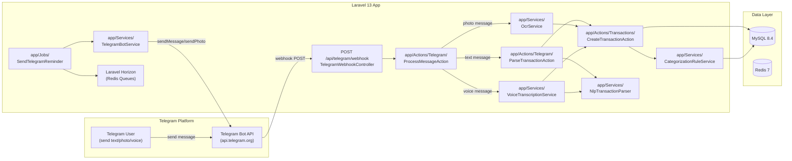
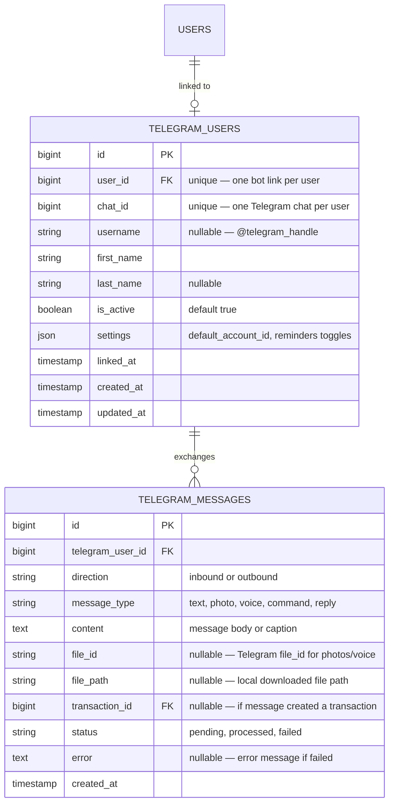

# Personal Finance Tracker SaaS — Telegram Bot Integration Plan

## Goal

Integrate a Telegram Bot as a companion input channel for the Personal Finance Tracker SaaS. Users link their Telegram account to their app account, then send text messages ("makan siang 50rb"), receipt photos, or voice messages via Telegram to create transactions instantly. The bot also serves as a notification channel for bill reminders, budget alerts, and optional daily/weekly summaries.

This plan is written for Iwan (CPA, ERP developer, 15+ years experience) building on the same stack/conventions used in `sarang-erp-laravel`, `hotel-resort-erp`, `daily-production`, and `stock-alert`: Laravel + Inertia + React + AntD, dark mode default, phase-by-phase delivery.

## Architecture



### Flow Summary

1. User sends a message to the Telegram bot (`@PersonalFinanceBot`)
2. Telegram delivers the update via webhook `POST` to `https://app.example.com/api/telegram/webhook`
3. `TelegramWebhookController` validates `X-Telegram-Bot-Api-Secret-Token` header
4. `ProcessMessageAction` routes the update based on message type:
   - **Text** → `ParseTransactionAction` (NLP parse → `CreateTransactionAction`)
   - **Photo** → Download file from Telegram → `OcrService::parse()` → reply with parsed result (confirmation flow)
   - **Voice** → Download audio → `VoiceTranscriptionService::transcribe()` → `NlpTransactionParser::parse()` → `CreateTransactionAction`
   - **Command** (`/balance`, `/today`, `/month`, `/budget`) → route to command handler
5. Responses sent back to the user via `TelegramBotService` using `sendMessage` API
6. Outbound: `SendTelegramReminder` queued job fires for bill reminders, budget alerts, and scheduled summaries

## Tech Stack Summary

| Layer | Choice |
|---|---|
| Bot API | Telegram Bot API (HTTP REST, webhook mode) |
| Bot SDK | `irazasyed/telegram-bot-sdk` (Laravel integration) or raw `Http` facade |
| Webhook Endpoint | Laravel route `POST /api/telegram/webhook` |
| Auth (Webhook) | `X-Telegram-Bot-Api-Secret-Token` header validation |
| User Linking | `telegram_users` table: `chat_id` → `user_id` → `team_id` |
| NLP Parsing | Regex pattern matching (Indonesian amounts) + `NlpTransactionParser` (existing) |
| OCR Reuse | `app/Services/OcrService` (existing) — invoked when photo received |
| STT Reuse | `app/Services/VoiceTranscriptionService` (existing) — invoked when voice received |
| Categorization | `app/Services/CategorizationRuleService` (existing) — auto-categorize parsed transactions |
| Transaction Creation | `app/Actions/Transactions/CreateTransactionAction` (existing, DRY reuse) |
| Queue | Laravel Horizon (Redis) |
| Notification Channel | Telegram (via `TelegramBotService`) — additional `via('telegram')` on existing notifications |
| Frontend | React + Inertia + AntD settings page |
| Deployment | Same VPS as main app (webhook URL = production domain) |

Guiding principles applied throughout every phase: **DRY** (reuse existing Actions/Services — `CreateTransactionAction`, `CategorizationRuleService`, `OcrService`, `VoiceTranscriptionService`, `NlpTransactionParser`), **YAGNI** (no Telegram-native user registration — linking only; no custom bot framework when `Http` facade suffices), **TDD** (write the failing Feature/Unit test before implementing the Action/Controller in every task marked `[TDD]`).

---

## Section 1: Core Bot Features (Reference)

1. **Quick Transaction Input via Text**
   - Indonesian natural language: "makan siang 50rb" → expense 50,000
   - Auto-detect income keywords: "gaji", "bonus", "dapat", "masuk", "terima"
   - Amount parsing: "50rb" = 50,000, "1.5jt" = 1,500,000, "5 juta" = 5,000,000
   - Default account: user's default account (configurable in settings)
   - Auto-categorize via existing `CategorizationRuleService`

2. **Photo Receipt OCR via Bot**
   - User sends receipt photo → bot downloads file from Telegram → queues `OcrService`
   - Reply with parsed result (merchant, amount, date) for confirmation
   - User confirms → `CreateTransactionAction` invoked with OCR result + user's default account

3. **Voice Input via Bot**
   - User sends voice note → bot downloads OGG audio → queues `VoiceTranscriptionService`
   - Transcript → `NlpTransactionParser` → `CreateTransactionAction`
   - Reply with created transaction summary

4. **Bot Commands**
   - `/start` — greet user, show link status, brief help
   - `/link` — generate one-time linking code (requires app auth)
   - `/balance` — account balances summary
   - `/today` — today's transactions
   - `/month` — monthly summary (income/expense/net)
   - `/budget` — budget utilization status (warnings if over threshold)
   - `/help` — list all commands
   - `/unlink` — disconnect Telegram from app account

5. **Reminders & Alerts via Telegram**
   - Bill reminders pushed to Telegram (additional channel alongside mail/webpush)
   - Budget threshold alerts (≥ notification_threshold)
   - Optional daily summary (configurable in settings: `daily_summary_enabled`)
   - Optional weekly summary (configurable: `weekly_summary_enabled`)

6. **User Linking & Settings**
   - Link flow: user in app → Settings → Telegram → "Connect" → generates unique token → user sends `/link <token>` to bot → `chat_id` stored against `user_id`
   - Settings configurable per-user: `default_account_id`, `daily_summary_enabled`, `weekly_summary_enabled`, `bill_reminders_enabled`, `budget_alerts_enabled`

---

## Section 2: Database Schema

### New Tables



### Migration Summary

| # | Migration | Table | Purpose |
|---|-----------|-------|---------|
| 1 | `create_telegram_users_table` | `telegram_users` | Link Telegram chat to app user |
| 2 | `create_telegram_messages_table` | `telegram_messages` | Log all bot exchanges |

### Model Relationships

```php
// app/Models/User.php — add relationship
public function telegramUser(): HasOne
{
    return $this->hasOne(TelegramUser::class);
}

// app/Models/TelegramUser.php
public function user(): BelongsTo
{
    return $this->belongsTo(User::class);
}

public function messages(): HasMany
{
    return $this->hasMany(TelegramMessage::class);
}
```

---

## Section 3: Security

| Concern | Approach |
|---|---|
| Webhook authentication | Validate `X-Telegram-Bot-Api-Secret-Token` HTTP header against `TELEGRAM_WEBHOOK_SECRET` in `.env`. 403 if mismatch. |
| CSRF | Webhook route excluded from CSRF middleware in `bootstrap/app.php` |
| Rate limiting | `throttle:telegram` middleware — 30 requests per minute per `chat_id` (resolved from request body `message.chat.id`) |
| User isolation | All queries scoped by `telegram_users.user_id` → resolve `team_id` from the user's `current_team_id` |
| Link security | One-time linking token, 10-minute expiry, single-use — generated via `Str::random(32)` |
| Bot token storage | `TELEGRAM_BOT_TOKEN` in `.env` — never exposed to frontend or logs |
| Data validation | All inbound message text sanitized; `strip_tags()` before NLP parse; file type validation (photo=JPEG/PNG, voice=OGG/MP3) |

### ENV Variables

```env
TELEGRAM_BOT_TOKEN=123456:ABC-DEF1234ghikl-zyx57W2v1u123ew11
TELEGRAM_WEBHOOK_SECRET=random-64-char-secret
TELEGRAM_WEBHOOK_URL=https://app.example.com/api/telegram/webhook
```

---

## Section 4: NLP Parsing for Indonesian

### Amount Pattern Matching (Regex)

Built on the existing `app/Services/NlpTransactionParser` — extend for richer Indonesian shorthand:

| Input | Parsed | Regex |
|---|---|---|
| `50rb` | 50,000 | `/(\\d+(?:\\.\\d+)?)\\s*rb/i` |
| `50ribu` | 50,000 | `/(\\d+(?:\\.\\d+)?)\\s*ribu/i` |
| `50 ribu` | 50,000 | `/(\\d+(?:\\.\\d+)?)\\s*ribu/i` |
| `1.5jt` | 1,500,000 | `/(\\d+(?:\\.\\d+)?)\\s*jt/i` |
| `1,5jt` | 1,500,000 | `/(\\d+(?:,\\d+)?)\\s*jt/i` |
| `1.5juta` | 1,500,000 | `/(\\d+(?:\\.\\d+)?)\\s*juta/i` |
| `5 juta` | 5,000,000 | `/(\\d+(?:\\.\\d+)?)\\s*juta/i` |
| `500000` | 500,000 | `/(\\d{4,})/` (raw number ≥ 1000) |
| `100k` | 100,000 | `/(\\d+(?:\\.\\d+)?)\\s*k/i` |

### Income Detection Keywords

```
gaji, gajian, bonus, dapat, terima, masuk, pemasukan, pendapatan,
freelance, proyek, project, refund, cashback
```

### Expense Detection Keywords (default)

Any input NOT matching income keywords is treated as **expense**:
```
beli, bayar, makan, minum, bensin, transport, listrik, air, pulsa,
paket, sewa, cicilan, langganan, donasi, topup
```

### Fallback Strategy

If the parser cannot extract an amount or type, the bot replies:
> Maaf, saya tidak bisa memparse transaksi dari: "{input}"
> Format: [deskripsi] [jumlah], contoh: "makan siang 50rb" atau "gaji 5jt"
> Coba lagi ya! 😊

### NLP Parsing Pipeline

```
Raw text → Preprocessor (lowercase, strip emoji, normalize)
         → AmountExtractor (regex patterns, ordered by specificity)
         → TypeDetector (keyword matching: income vs expense)
         → DescriptionExtractor (text before the amount)
         → CategorySuggester (CategorizationRuleService::suggest)
         → Validation (amount > 0, description not empty)
         → Result DTO or error message
```

---

## Section 5: Bot Commands Reference

| Command | Description | Example Reply |
|---|---|---|
| `/start` | Welcome + help | "Halo Iwan! 👋 Gue @PersonalFinanceBot. Kirim teks transaksi, foto struk, atau voice note. Ketik /help buat lihat semua perintah." |
| `/link <token>` | Link Telegram to app account | "Akun Telegram lo berhasil di-link ke Personal Finance Tracker! 🎉 Sekarang lo bisa kirim transaksi dari sini." |
| `/balance` | Account balances | "💰 *Saldo*\n• BCA: Rp 2.500.000\n• Cash: Rp 350.000\n• Mandiri: Rp 15.000.000" |
| `/today` | Today's transactions | "📋 *Hari Ini (Jumat, 8 Agu 2026)*\n• [Expense] Makan siang — Rp 50.000 (Makanan)\n• [Income] Gaji — Rp 5.000.000 (Gaji)\n\n*Net: +Rp 4.950.000*" |
| `/month` | Monthly summary | "📊 *Agustus 2026*\n• Income: Rp 5.000.000\n• Expense: Rp 850.000\n• Net: +Rp 4.150.000\n• 5 transactions" |
| `/budget` | Budget utilization | "📊 *Budget Status*\n• Makanan: 45% (Rp 900.000 / Rp 2.000.000) ✅\n• Transport: 85% (Rp 850.000 / Rp 1.000.000) ⚠️" |
| `/help` | Command list | Lists all commands |
| `/unlink` | Disconnect Telegram | "Akun Telegram lo udah di-unlink. Lo bisa link lagi kapan aja dari Settings di app." |

---

## Section 6: Integration Points with Existing Code

### Services to Reuse (DRY)

| Existing Service/Action | Telegram Usage |
|---|---|
| `app/Services/NlpTransactionParser` | Parse text messages → structured transaction data |
| `app/Services/OcrService` | Parse receipt photos sent via Telegram |
| `app/Services/VoiceTranscriptionService` | Transcribe voice notes → text → NLP parse |
| `app/Services/CategorizationRuleService` | Auto-categorize parsed transactions |
| `app/Actions/Transactions/CreateTransactionAction` | Create transaction from parsed data |
| `app/Actions/Budgets/CalculateBudgetUtilizationAction` | `/budget` command |
| `app/Actions/Reports/MonthlySummaryAction` | `/month` command |
| `app/Jobs/SendBillReminders` | Extend to also send via Telegram |
| `app/Notifications/BillReminderDue` | Add `telegram` channel to `via()` |

### New Files to Create

```
app/
├── Models/
│   ├── TelegramUser.php
│   └── TelegramMessage.php
├── Services/
│   └── TelegramBotService.php            (send message, photo, inline keyboard)
├── Http/
│   └── Controllers/Api/
│       └── TelegramWebhookController.php (webhook handler, no auth)
├── Actions/Telegram/
│   ├── ProcessMessageAction.php          (route message by type)
│   ├── ParseTransactionAction.php        (NLP text → structured data)
│   ├── HandleCommandAction.php           (/balance, /today, /month, /budget, /help)
│   └── GenerateLinkTokenAction.php       (create one-time linking token)
├── Jobs/
│   ├── SendTelegramReminder.php          (bill/budget alert via Telegram)
│   ├── SendDailyTelegramSummary.php      (daily summary)
│   └── SendWeeklyTelegramSummary.php     (weekly summary)
├── Notifications/
│   └── TelegramNotification.php          (Telegram channel for Laravel notifications)
└── DTOs/
    └── TelegramMessageData.php           (structured inbound message data)

resources/js/
├── Pages/Settings/
│   └── Telegram.jsx                      (Telegram settings page)
└── Components/Settings/
    └── TelegramSettings.jsx              (connection status + toggles)
```

---

## Section 7: API Routes

```php
// routes/api.php — add alongside existing routes

// Public — no auth, validated by Telegram secret token
Route::post('/telegram/webhook', [TelegramWebhookController::class, 'handle'])
    ->middleware('throttle:telegram');

// Admin-only — webhook registration (use with caution)
Route::get('/telegram/set-webhook', [TelegramWebhookController::class, 'setWebhook'])
    ->middleware(['auth:sanctum', 'admin']);

// Authenticated — user Telegram management
Route::middleware(['auth:sanctum'])->prefix('telegram')->group(function () {
    Route::get('/status', [TelegramSettingsController::class, 'status']);
    Route::post('/generate-link-token', [TelegramSettingsController::class, 'generateLinkToken']);
    Route::post('/unlink', [TelegramSettingsController::class, 'unlink']);
    Route::put('/settings', [TelegramSettingsController::class, 'updateSettings']);
});
```

### Web Routes

```php
// routes/web.php — add alongside existing settings routes
Route::middleware('auth')->group(function () {
    Route::get('/settings/telegram', fn () => inertia('Settings/Telegram'))
        ->name('settings.telegram');
});
```

---

## Section 8: Notification Channels

Extend existing `BillReminderDue` notification to also send via Telegram:

```php
// app/Notifications/BillReminderDue.php — update via() method
public function via(object $notifiable): array
{
    $channels = ['mail', WebPushChannel::class];

    // Add Telegram if user has linked Telegram and enabled bill reminders
    if ($notifiable->telegramUser?->is_active
        && ($notifiable->telegramUser->settings['bill_reminders_enabled'] ?? true)) {
        $channels[] = 'telegram';
    }

    return $channels;
}

public function toTelegram(object $notifiable): array
{
    return [
        'text' => "💸 *Bill Reminder*\n"
            . "{$this->billReminder->name}\n"
            . "Amount: {$this->billReminder->currency} {$this->billReminder->amount}\n"
            . "Due: {$this->billReminder->due_date->format('M j, Y')}\n"
            . "Days left: {$this->billReminder->due_date->diffInDays(today())}",
        'parse_mode' => 'Markdown',
    ];
}
```

Create `app/Notifications/Channels/TelegramChannel.php`:

```php
namespace App\Notifications\Channels;

use App\Services\TelegramBotService;
use Illuminate\Notifications\Notification;

class TelegramChannel
{
    public function send(object $notifiable, Notification $notification): void
    {
        if (! method_exists($notification, 'toTelegram')) {
            return;
        }

        $data = $notification->toTelegram($notifiable);
        $chatId = $notifiable->telegramUser->chat_id;

        app(TelegramBotService::class)->sendMessage($chatId, $data['text'], $data['parse_mode'] ?? null);
    }
}
```

---

## Section 9: React Frontend

### Telegram Settings Page

`resources/js/Pages/Settings/Telegram.jsx` — accessible from the settings sidebar:

```
+--------------------------------------------------------------+
|  ⚙️ Settings / Telegram                                        |
|                                                              |
|  ┌──────────────────────────────────────────────────────────┐ |
|  │  📱 Telegram Connection                                   │ |
|  │                                                          │ |
|  │  Status: ● Connected as @iwansurya                        │ |
|  │  Linked: August 8, 2026                                   │ |
|  │                                                          │ |
|  │  [Unlink Telegram]                                        │ |
|  └──────────────────────────────────────────────────────────┘ |
|                                                              |
|  ┌──────────────────────────────────────────────────────────┐ |
|  │  🔔 Notification Preferences                              │ |
|  │                                                          │ |
|  │  [Toggle] Bill Reminders via Telegram                     │ |
|  │  [Toggle] Budget Alerts via Telegram                      │ |
|  │  [Toggle] Daily Summary (08:00 WIB)                       │ |
|  │  [Toggle] Weekly Summary (Monday 09:00 WIB)               │ |
|  └──────────────────────────────────────────────────────────┘ |
|                                                              |
|  ┌──────────────────────────────────────────────────────────┐ |
|  │  💳 Default Transaction Account                            │ |
|  │                                                          │ |
|  │  [Dropdown: Select Account ▼]   BCA - Checking            │ |
|  └──────────────────────────────────────────────────────────┘ |
+--------------------------------------------------------------+
```

### Unlinked State

```
+--------------------------------------------------------------+
|  📱 Telegram Connection                                       |
|                                                              |
|  Status: ○ Not Connected                                    |
|                                                              |
|  Link your Telegram to send transactions via chat.           |
|                                                              |
|  Steps:                                                      |
|  1. Click "Generate Link Code"                               |
|  2. Open Telegram: @PersonalFinanceBot                        |
|  3. Send: /link ABC123DEF                                     |
|                                                              |
|  [Generate Link Code]                                        |
|                                                              |
|  ┌──────────────────────────────────────────────────────────┐ |
|  │  Your link code: ABC123DEF                                │ |
|  │  Expires in: 9:52                                         │ |
|  │  Send this to @PersonalFinanceBot: /link ABC123DEF        │ |
|  │  [Copy Code]                                              │ |
|  └──────────────────────────────────────────────────────────┘ |
+--------------------------------------------------------------+
```

---

## Section 10: TelegramBotService

```php
// app/Services/TelegramBotService.php

namespace App\Services;

use Illuminate\Support\Facades\Http;

class TelegramBotService
{
    private string $token;
    private string $baseUrl;

    public function __construct()
    {
        $this->token = config('services.telegram.bot_token');
        $this->baseUrl = "https://api.telegram.org/bot{$this->token}";
    }

    public function sendMessage(string $chatId, string $text, ?string $parseMode = null): array
    {
        return Http::post("{$this->baseUrl}/sendMessage", [
            'chat_id' => $chatId,
            'text' => $text,
            'parse_mode' => $parseMode ?? 'Markdown',
        ])->json();
    }

    public function sendPhoto(string $chatId, string $photoUrl, ?string $caption = null): array
    {
        return Http::post("{$this->baseUrl}/sendPhoto", [
            'chat_id' => $chatId,
            'photo' => $photoUrl,
            'caption' => $caption,
        ])->json();
    }

    public function sendInlineKeyboard(string $chatId, string $text, array $keyboard): array
    {
        return Http::post("{$this->baseUrl}/sendMessage", [
            'chat_id' => $chatId,
            'text' => $text,
            'reply_markup' => json_encode(['inline_keyboard' => $keyboard]),
        ])->json();
    }

    public function getFile(string $fileId): ?array
    {
        $response = Http::get("{$this->baseUrl}/getFile", ['file_id' => $fileId])->json();

        if (! ($response['ok'] ?? false)) {
            return null;
        }

        return $response['result'];
    }

    public function downloadFile(string $filePath, string $savePath): bool
    {
        $url = "https://api.telegram.org/file/bot{$this->token}/{$filePath}";
        $response = Http::get($url);

        if ($response->successful()) {
            file_put_contents($savePath, $response->body());
            return true;
        }

        return false;
    }

    public function setWebhook(string $url, string $secretToken): array
    {
        return Http::post("{$this->baseUrl}/setWebhook", [
            'url' => $url,
            'secret_token' => $secretToken,
            'allowed_updates' => ['message', 'callback_query'],
        ])->json();
    }

    public function deleteWebhook(): array
    {
        return Http::post("{$this->baseUrl}/deleteWebhook")->json();
    }

    public function getWebhookInfo(): array
    {
        return Http::get("{$this->baseUrl}/getWebhookInfo")->json();
    }
}
```

### Config

```php
// config/services.php — add
'telegram' => [
    'bot_token' => env('TELEGRAM_BOT_TOKEN'),
    'webhook_secret' => env('TELEGRAM_WEBHOOK_SECRET'),
    'webhook_url' => env('TELEGRAM_WEBHOOK_URL'),
    'bot_username' => env('TELEGRAM_BOT_USERNAME', 'PersonalFinanceBot'),
],
```

---

## Section 11: Implementation Phases

Each phase lists bite-sized tasks (2–5 minutes each) with exact file paths and, where non-trivial, complete code. Principles: **DRY** (reuse existing Actions/Services), **YAGNI** (skip anything not required by the current phase's feature), **TDD** (test file precedes/accompanies implementation for every task marked `[TDD]`).

### Phase 1 — Bot Setup + Webhook + User Linking

1. Register a new bot with [@BotFather](https://t.me/BotFather) on Telegram. Note the bot token and set a unique username.

2. Add to `.env`:
   ```
   TELEGRAM_BOT_TOKEN=123456:ABC-DEF1234ghikl-zyx57W2v1u123ew11
   TELEGRAM_WEBHOOK_SECRET=<random-64-char-string>
   TELEGRAM_WEBHOOK_URL=https://app.example.com/api/telegram/webhook
   TELEGRAM_BOT_USERNAME=PersonalFinanceBot
   ```

3. Add `config/services.php` entry per Section 10 config.

4. `php artisan make:model TelegramUser -m` → edit migration at `database/migrations/xxxx_create_telegram_users_table.php`:
   ```php
   Schema::create('telegram_users', function (Blueprint $table) {
       $table->id();
       $table->foreignId('user_id')->unique()->constrained()->cascadeOnDelete();
       $table->bigInteger('chat_id')->unique();
       $table->string('username')->nullable();
       $table->string('first_name');
       $table->string('last_name')->nullable();
       $table->boolean('is_active')->default(true);
       $table->json('settings')->nullable();
       $table->timestamp('linked_at')->nullable();
       $table->timestamps();

       $table->index('chat_id');
   });
   ```

5. `php artisan make:model TelegramMessage -m` → edit migration at `database/migrations/xxxx_create_telegram_messages_table.php`:
   ```php
   Schema::create('telegram_messages', function (Blueprint $table) {
       $table->id();
       $table->foreignId('telegram_user_id')->constrained()->cascadeOnDelete();
       $table->string('direction'); // 'inbound' or 'outbound'
       $table->string('message_type'); // 'text', 'photo', 'voice', 'command', 'reply'
       $table->text('content')->nullable();
       $table->string('file_id')->nullable();
       $table->string('file_path')->nullable();
       $table->foreignId('transaction_id')->nullable()->constrained()->nullOnDelete();
       $table->string('status')->default('pending'); // 'pending', 'processed', 'failed'
       $table->text('error')->nullable();
       $table->timestamp('created_at')->nullable();
   });
   ```

6. Run `php artisan migrate`.

7. Edit `app/Models/TelegramUser.php`:
   ```php
   namespace App\Models;

   use Illuminate\Database\Eloquent\Model;
   use Illuminate\Database\Eloquent\Relations\BelongsTo;
   use Illuminate\Database\Eloquent\Relations\HasMany;

   class TelegramUser extends Model
   {
       protected $fillable = [
           'user_id', 'chat_id', 'username', 'first_name', 'last_name',
           'is_active', 'settings', 'linked_at',
       ];

       protected $casts = [
           'is_active' => 'boolean',
           'settings' => 'array',
           'linked_at' => 'datetime',
       ];

       public function user(): BelongsTo
       {
           return $this->belongsTo(User::class);
       }

       public function messages(): HasMany
       {
           return $this->hasMany(TelegramMessage::class);
       }
   }
   ```

8. Edit `app/Models/User.php` — add relationship:
   ```php
   public function telegramUser(): HasOne
   {
       return $this->hasOne(TelegramUser::class);
   }
   ```

9. Edit `app/Models/TelegramMessage.php`.

10. Manually create `app/Services/TelegramBotService.php` per Section 10.

11. `php artisan make:controller Api/TelegramWebhookController` at `app/Http/Controllers/Api/TelegramWebhookController.php`:
    ```php
    namespace App\Http\Controllers\Api;

    use App\Http\Controllers\Controller;
    use Illuminate\Http\Request;
    use Illuminate\Http\Response;

    class TelegramWebhookController extends Controller
    {
        public function handle(Request $request): Response
        {
            // Validate secret token
            $headerToken = $request->header('X-Telegram-Bot-Api-Secret-Token');
            $expectedToken = config('services.telegram.webhook_secret');

            if (! hash_equals($expectedToken, $headerToken ?? '')) {
                return response()->noContent(403);
            }

            // Delegate to ProcessMessageAction
            // (wire in task below)

            return response()->noContent(200);
        }

        public function setWebhook(): array
        {
            $service = app(TelegramBotService::class);
            $url = config('services.telegram.webhook_url');
            $secret = config('services.telegram.webhook_secret');

            return $service->setWebhook($url, $secret);
        }
    }
    ```

12. Register routes in `routes/api.php`:
    ```php
    // Public — Telegram webhook (before auth:sanctum group!)
    Route::post('/telegram/webhook', [TelegramWebhookController::class, 'handle'])
        ->middleware('throttle:telegram');

    Route::get('/telegram/set-webhook', [TelegramWebhookController::class, 'setWebhook']);
    ```

13. Register Telegram rate limiter in `bootstrap/app.php` (or `AppServiceProvider::boot()`):
    ```php
    RateLimiter::for('telegram', function (Request $request) {
        $chatId = $request->input('message.chat.id')
            ?? $request->input('callback_query.message.chat.id');

        return Limit::perMinute(30)->by($chatId ?? $request->ip());
    });
    ```

14. Exclude webhook from CSRF in `bootstrap/app.php`:
    ```php
    ->withMiddleware(function (Middleware $middleware) {
        $middleware->validateCsrfTokens(except: [
            'api/telegram/webhook',
            'webhook/*',
        ]);
    })
    ```

15. `[TDD]` Write `tests/Feature/Telegram/WebhookSecurityTest.php`:
    - Missing secret token → 403
    - Wrong secret token → 403
    - Correct secret token → 200

16. Create `app/Services/TelegramBotService.php` if not yet created (the full implementation from Section 10).

17. Create `app/Actions/Telegram/GenerateLinkTokenAction.php`:
    ```php
    namespace App\Actions\Telegram;

    use Illuminate\Support\Facades\Cache;
    use Illuminate\Support\Str;

    class GenerateLinkTokenAction
    {
        public function execute(int $userId): string
        {
            $token = Str::random(8); // Short, user-friendly token
            Cache::put("telegram_link:{$token}", $userId, now()->addMinutes(10));
            return $token;
        }
    }
    ```

18. `[TDD]` Write `tests/Feature/Telegram/LinkTokenTest.php`:
    - Generate token → stored in cache with userId
    - Expired token → returns null
    - Already used token → returns null (single-use)

19. Create `app/Actions/Telegram/ProcessMessageAction.php` (stub — full routing in later phases):
    ```php
    namespace App\Actions\Telegram;

    use App\Models\TelegramMessage;
    use App\Models\TelegramUser;
    use App\Services\TelegramBotService;
    use Illuminate\Support\Facades\Cache;

    class ProcessMessageAction
    {
        public function __construct(
            private TelegramBotService $bot,
            private HandleCommandAction $commandHandler,
            private ParseTransactionAction $txnParser,
        ) {}

        public function execute(array $update): void
        {
            $message = $update['message'] ?? null;
            if (! $message) return;

            $chatId = $message['chat']['id'];
            $text = $message['text'] ?? ($message['caption'] ?? '');

            // Resolve TelegramUser
            $telegramUser = TelegramUser::where('chat_id', $chatId)->first();

            // Log inbound message
            TelegramMessage::create([
                'telegram_user_id' => $telegramUser?->id,
                'direction' => 'inbound',
                'message_type' => $this->detectType($message),
                'content' => $text,
                'file_id' => $message['photo'][0]['file_id'] ?? ($message['voice']['file_id'] ?? null),
                'status' => 'pending',
            ]);

            // If not linked, show link instructions
            if (! $telegramUser || ! $telegramUser->is_active) {
                $this->bot->sendMessage($chatId, $this->unlinkedMessage());
                return;
            }

            // Route by type
            if (str_starts_with($text, '/')) {
                $this->commandHandler->execute($telegramUser, $text);
            } elseif (! empty($message['photo'])) {
                // Photo → Phase 3
                $this->bot->sendMessage($chatId, '📸 Foto diterima. OCR dalam antrian...');
            } elseif (! empty($message['voice'])) {
                // Voice → Phase 3
                $this->bot->sendMessage($chatId, '🎤 Voice note diterima. Processing...');
            } elseif (! empty($text)) {
                // Text → Phase 2
                $this->txnParser->execute($telegramUser, $text);
            }
        }

        private function detectType(array $message): string
        {
            if (! empty($message['photo'])) return 'photo';
            if (! empty($message['voice'])) return 'voice';
            if (! empty($message['text']) && str_starts_with($message['text'], '/')) return 'command';
            return 'text';
        }

        private function unlinkedMessage(): string
        {
            return "👋 Halo! Gue @PersonalFinanceBot.\n\n"
                . "Buat mulai pakai, link Telegram lo dulu:\n"
                . "1. Buka Settings → Telegram di aplikasi\n"
                . "2. Copy link code yang muncul\n"
                . "3. Kirim /link <code> ke sini\n\n"
                . "Ketik /help buat bantuan.";
        }
    }
    ```

20. Create `app/Actions/Telegram/HandleCommandAction.php` (Phase 1: /start, /help, /link, /unlink only):
    ```php
    namespace App\Actions\Telegram;

    use App\Models\TelegramUser;
    use App\Services\TelegramBotService;
    use Illuminate\Support\Facades\Cache;

    class HandleCommandAction
    {
        public function __construct(private TelegramBotService $bot) {}

        public function execute(TelegramUser $telegramUser, string $text): void
        {
            $parts = explode(' ', trim($text));
            $command = $parts[0];
            $arg = $parts[1] ?? null;
            $chatId = $telegramUser->chat_id;

            match ($command) {
                '/start' => $this->start($chatId, $telegramUser),
                '/help' => $this->help($chatId),
                '/link' => $this->link($chatId, $telegramUser, $arg),
                '/unlink' => $this->unlink($chatId, $telegramUser),
                '/balance' => $this->bot->sendMessage($chatId, '💼 Balance — coming in Phase 4!'),
                '/today' => $this->bot->sendMessage($chatId, '📋 Today — coming in Phase 4!'),
                '/month' => $this->bot->sendMessage($chatId, '📊 Month — coming in Phase 4!'),
                '/budget' => $this->bot->sendMessage($chatId, '📊 Budget — coming in Phase 4!'),
                default => $this->bot->sendMessage($chatId, "Perintah nggak dikenal. Ketik /help buat lihat daftar perintah."),
            };
        }

        private function start(string $chatId, TelegramUser $telegramUser): void
        {
            $name = $telegramUser->user->name;
            $this->bot->sendMessage($chatId,
                "Halo {$name}! 👋\n\n"
                . "Akun Telegram lo udah tersambung ke Personal Finance Tracker.\n\n"
                . "📝 *Cara Pakai:*\n"
                . "• Kirim teks: \"makan siang 50rb\" → expense 50,000\n"
                . "• Kirim teks: \"gaji 5jt\" → income 5,000,000\n"
                . "• Kirim foto struk → OCR auto-fill\n"
                . "• Kirim voice note → transcribe + parse\n\n"
                . "Ketik /help buat lihat semua perintah."
            );
        }

        private function help(string $chatId): void
        {
            $this->bot->sendMessage($chatId,
                "🤖 *Perintah Bot*\n\n"
                . "/start — Mulai / sapaan\n"
                . "/help — Daftar perintah ini\n"
                . "/balance — Cek saldo akun\n"
                . "/today — Transaksi hari ini\n"
                . "/month — Ringkasan bulan ini\n"
                . "/budget — Status budget\n"
                . "/link — Link akun (dari app)\n"
                . "/unlink — Putuskan koneksi\n\n"
                . "📝 *Input Teks:*\n"
                . "\"[deskripsi] [jumlah]\"\n"
                . "Contoh: \"makan siang 50rb\"\n"
                . "Contoh: \"gaji 5jt\"\n\n"
                . "📸 Kirim foto struk atau 🎤 voice note juga bisa!"
            );
        }

        private function link(string $chatId, TelegramUser $telegramUser, ?string $token): void
        {
            if (! $token) {
                $this->bot->sendMessage($chatId,
                    "ℹ️ Buat link akun lo:\n"
                    . "1. Buka Settings → Telegram di aplikasi\n"
                    . "2. Klik \"Generate Link Code\"\n"
                    . "3. Kirim /link <code> ke sini"
                );
                return;
            }

            $userId = Cache::pull("telegram_link:{$token}");

            if (! $userId) {
                $this->bot->sendMessage($chatId,
                    "❌ Kode link nggak valid atau udah expired.\n"
                    . "Coba generate kode baru dari Settings → Telegram di aplikasi."
                );
                return;
            }

            // If user already has a TelegramUser with different chat_id, deactivate the old one
            if ($telegramUser->user_id !== $userId) {
                TelegramUser::where('user_id', $telegramUser->user_id)->update(['is_active' => false]);
                $telegramUser->update([
                    'user_id' => $userId,
                    'is_active' => true,
                    'linked_at' => now(),
                ]);
            }

            $this->bot->sendMessage($chatId,
                "✅ Akun Telegram lo berhasil di-link ke Personal Finance Tracker!\n\n"
                . "Sekarang lo bisa kirim transaksi dari sini. Ketik /help buat lihat caranya."
            );
        }

        private function unlink(string $chatId, TelegramUser $telegramUser): void
        {
            $telegramUser->update(['is_active' => false]);
            $this->bot->sendMessage($chatId,
                "🔌 Akun Telegram lo udah di-unlink.\n"
                . "Lo bisa link lagi kapan aja dari Settings → Telegram di aplikasi."
            );
        }
    }
    ```

21. Create `app/Http/Controllers/Api/TelegramSettingsController.php`:
    ```php
    namespace App\Http\Controllers\Api;

    use App\Actions\Telegram\GenerateLinkTokenAction;
    use App\Http\Controllers\Controller;
    use Illuminate\Http\Request;

    class TelegramSettingsController extends Controller
    {
        public function status(Request $request): array
        {
            $telegramUser = $request->user()->telegramUser;

            return [
                'data' => [
                    'is_linked' => $telegramUser && $telegramUser->is_active,
                    'username' => $telegramUser?->username,
                    'first_name' => $telegramUser?->first_name,
                    'linked_at' => $telegramUser?->linked_at,
                    'settings' => $telegramUser?->settings ?? $this->defaultSettings(),
                ],
            ];
        }

        public function generateLinkToken(Request $request, GenerateLinkTokenAction $action): array
        {
            $token = $action->execute($request->user()->id);

            return [
                'data' => ['token' => $token, 'expires_in_seconds' => 600],
                'message' => 'Link token generated. Send /link ' . $token . ' to @' . config('services.telegram.bot_username'),
            ];
        }

        public function unlink(Request $request): array
        {
            $request->user()->telegramUser?->update(['is_active' => false]);

            return ['data' => null, 'message' => 'Telegram unlinked successfully.'];
        }

        public function updateSettings(Request $request): array
        {
            $validated = $request->validate([
                'default_account_id' => 'nullable|exists:accounts,id',
                'daily_summary_enabled' => 'boolean',
                'weekly_summary_enabled' => 'boolean',
                'bill_reminders_enabled' => 'boolean',
                'budget_alerts_enabled' => 'boolean',
            ]);

            $telegramUser = $request->user()->telegramUser;
            if ($telegramUser) {
                $telegramUser->update(['settings' => array_merge($telegramUser->settings ?? [], $validated)]);
            }

            return ['data' => $telegramUser?->settings, 'message' => 'Settings updated.'];
        }

        private function defaultSettings(): array
        {
            return [
                'default_account_id' => null,
                'daily_summary_enabled' => false,
                'weekly_summary_enabled' => false,
                'bill_reminders_enabled' => true,
                'budget_alerts_enabled' => true,
            ];
        }
    }
    ```

22. Add auth routes in `routes/api.php` (inside `auth:sanctum` group):
    ```php
    Route::prefix('telegram')->group(function () {
        Route::get('/status', [TelegramSettingsController::class, 'status']);
        Route::post('/generate-link-token', [TelegramSettingsController::class, 'generateLinkToken']);
        Route::post('/unlink', [TelegramSettingsController::class, 'unlink']);
        Route::put('/settings', [TelegramSettingsController::class, 'updateSettings']);
    });
    ```

23. `[TDD]` Write `tests/Feature/Telegram/WebhookTest.php`:
    - Webhook receives `/start` → reply sent
    - Webhook receives `/link <valid_token>` → user linked
    - Webhook receives text from unlinked chat → instructions returned
    - Rate limit: >30 requests from same chat_id → 429

24. Verify with `php artisan test --filter=Telegram` — all green.

25. Register webhook (one-time setup): `curl -X POST "https://api.telegram.org/bot<TOKEN>/setWebhook" -d "url=<APP_URL>/api/telegram/webhook" -d "secret_token=<SECRET>"` — or use the `/api/telegram/set-webhook` route after deploy.

---

### Phase 2 — Text Transaction Input + NLP Parsing

1. `[TDD]` Write `tests/Unit/Telegram/ParseTransactionActionTest.php`:
   - "makan siang 50rb" → amount=50000, type=expense, description="makan siang"
   - "gaji 5jt" → amount=5000000, type=income, description="gaji"
   - "beli bensin 200 ribu" → amount=200000, type=expense
   - "bonus 1.5 juta" → amount=1500000, type=income
   - "freelance 100k" → amount=100000, type=income
   - "50000" → amount=50000, type=expense (default), description=null
   - Empty text → parse error
   - Text with no amount → parse error

2. Create `app/Actions/Telegram/ParseTransactionAction.php`:
   ```php
   namespace App\Actions\Telegram;

   use App\Actions\Transactions\CreateTransactionAction;
   use App\Models\Account;
   use App\Models\TelegramUser;
   use App\Services\CategorizationRuleService;
   use App\Services\NlpTransactionParser;
   use App\Services\TelegramBotService;

   class ParseTransactionAction
   {
       public function __construct(
           private NlpTransactionParser $nlpParser,
           private CreateTransactionAction $createTxn,
           private CategorizationRuleService $categorizer,
           private TelegramBotService $bot,
       ) {}

       public function execute(TelegramUser $telegramUser, string $text): void
       {
           $chatId = $telegramUser->chat_id;
           $parsed = $this->nlpParser->parse($text);

           if (! $parsed['amount'] || $parsed['amount'] <= 0) {
               $this->bot->sendMessage($chatId,
                   "❌ Maaf, saya tidak bisa memparse transaksi dari: \"{$text}\"\n\n"
                   . "Format: [deskripsi] [jumlah]\n"
                   . "Contoh: \"makan siang 50rb\" atau \"gaji 5jt\"\n\n"
                   . "Coba lagi ya! 😊"
               );
               return;
           }

           // Get default account
           $settings = $telegramUser->settings ?? [];
           $accountId = $settings['default_account_id'] ?? null;

           if (! $accountId) {
               // Find first active account for the user's team
               $accountId = Account::where('is_active', true)->first()?->id;
           }

           if (! $accountId) {
               $this->bot->sendMessage($chatId, '❌ Nggak ada akun yang tersedia. Bikin akun dulu di aplikasi ya.');
               return;
           }

           // Auto-categorize
           $category = $this->categorizer->suggest(
               $parsed['merchant'] ?? $text,
               null
           );

           $user = $telegramUser->user;
           auth()->login($user); // Need auth context for BelongsToTeam scope + CreateTransactionAction

           try {
               $transaction = $this->createTxn->execute([
                   'team_id' => $user->current_team_id,
                   'user_id' => $user->id,
                   'account_id' => $accountId,
                   'type' => $parsed['type'],
                   'amount' => $parsed['amount'],
                   'currency' => $user->currency ?? 'IDR',
                   'description' => $parsed['merchant'] ?? $text,
                   'notes' => $parsed['notes'] ?? null,
                   'category_id' => $category['category_id'],
                   'transaction_date' => now()->toDateString(),
                   'source' => 'telegram',
               ]);

               $typeEmoji = $parsed['type'] === 'income' ? '💰' : '💸';
               $typeLabel = $parsed['type'] === 'income' ? 'Pemasukan' : 'Pengeluaran';
               $categoryName = $transaction->category?->name ?? 'Uncategorized';

               $this->bot->sendMessage($chatId,
                   "{$typeEmoji} *{$typeLabel} Tercatat!*\n\n"
                   . "Deskripsi: {$transaction->description}\n"
                   . "Jumlah: Rp " . number_format($transaction->amount, 0, ',', '.') . "\n"
                   . "Kategori: {$categoryName}\n"
                   . "Akun: {$transaction->account->name}\n"
                   . "Tanggal: " . now()->format('d M Y')
               );
           } catch (\Exception $e) {
               $this->bot->sendMessage($chatId, "❌ Gagal mencatat transaksi: {$e->getMessage()}");
               throw $e;
           }
       }
   }
   ```

3. Update `app/Services/NlpTransactionParser.php` — enhance the `parse()` method with richer Indonesian amount patterns per Section 4 regex table. Add the `1.5jt` and `1,5jt` patterns:
   ```php
   // Add before the existing amount extraction logic:
   if (preg_match('/(\d+(?:[.,]\d+)?)\s*(jt|juta)/i', $transcript, $m)) {
       $result['amount'] = (int) (float) str_replace(',', '.', $m[1]) * 1000000;
   }
   // Enhance ribu pattern:
   if (preg_match('/(\d+(?:[.,]\d+)?)\s*(rb|ribu|k)/i', $transcript, $m)) {
       $result['amount'] = (int) (float) str_replace(',', '.', $m[1]) * 1000;
   }
   ```

4. `[TDD]` Write `tests/Unit/Services/NlpTransactionParserIndonesianTest.php` — covers all Indonesian amount patterns from Section 4.

5. Run `php artisan test --filter=NlpTransactionParserIndonesian` until green.

6. Wire `ParseTransactionAction` into `ProcessMessageAction` (already done in Phase 1 stub — verify the wiring).

7. `[TDD]` Write `tests/Feature/Telegram/TextTransactionTest.php`:
    - Send text from linked user → transaction created
    - Send text from linked user with no account → error message returned
    - Send ambiguous text → parse error returned
    - Transaction has correct `source = 'telegram'`

8. Run `php artisan test --filter=Telegram` — all green.

---

### Phase 3 — Photo/Voice Input via Bot

1. `[TDD]` Write `tests/Feature/Telegram/PhotoOcrTest.php`:
    - Webhook receives photo message → file downloaded → OCR queued → reply sent
    - OCR result → confirmation message sent to user

2. Add photo handling in `ProcessMessageAction` — replace stub:
   ```php
   // In ProcessMessageAction::execute(), after detecting photo:
   if (! empty($message['photo'])) {
       $this->handlePhoto($telegramUser, $message, $chatId);
       return;
   }
   ```

3. Implement photo download flow in `ProcessMessageAction`:
   ```php
   private function handlePhoto(TelegramUser $telegramUser, array $message, string $chatId): void
   {
       // Get the largest photo (last in array)
       $photo = end($message['photo']);
       $fileId = $photo['file_id'];

       // Get file path from Telegram
       $fileInfo = $this->bot->getFile($fileId);
       if (! $fileInfo) {
           $this->bot->sendMessage($chatId, '❌ Gagal download foto. Coba lagi.');
           return;
       }

       // Download to storage
       $fileName = 'telegram-receipts/' . uniqid() . '.jpg';
       $savePath = storage_path('app/' . $fileName);

       if (! $this->bot->downloadFile($fileInfo['file_path'], $savePath)) {
           $this->bot->sendMessage($chatId, '❌ Gagal download foto. Coba lagi.');
           return;
       }

       // Log message with file path
       TelegramMessage::where('telegram_user_id', $telegramUser->id)
           ->where('file_id', $fileId)
           ->latest()
           ->first()
           ?->update(['file_path' => $fileName]);

       // Queue OCR processing (reuse existing OcrService + ProcessOcrJob pattern)
       $this->bot->sendMessage($chatId,
           '📸 Foto struk diterima! Lagi diproses OCR...\n\n'
           . 'Hasilnya bakal dikirim ke sini dalam beberapa detik.'
       );

       // Dispatch OCR with callback to send result back via Telegram
       ProcessOcrJob::dispatch($savePath, $telegramUser->user_id, $telegramUser->user->current_team_id)
           ->chain([
               new SendOcrResultToTelegram($telegramUser->id, $savePath),
           ]);
   }
   ```

4. Create queued job `app/Jobs/SendOcrResultToTelegram.php`:
   ```php
   namespace App\Jobs;

   use App\Models\OcrJob;
   use App\Models\TelegramUser;
   use App\Services\TelegramBotService;
   use Illuminate\Contracts\Queue\ShouldQueue;
   use Illuminate\Foundation\Queue\Queueable;

   class SendOcrResultToTelegram implements ShouldQueue
   {
       use Queueable;

       public function __construct(
           private int $telegramUserId,
           private string $filePath,
       ) {}

       public function handle(TelegramBotService $bot): void
       {
           $telegramUser = TelegramUser::find($this->telegramUserId);
           if (! $telegramUser?->is_active) return;

           $chatId = $telegramUser->chat_id;

           // Find the most recent OCR job for this file
           $ocrJob = OcrJob::where('file_path', $this->filePath)
               ->latest()
               ->first();

           if (! $ocrJob || $ocrJob->status !== 'completed') {
               $bot->sendMessage($chatId, '❌ Gagal memproses OCR. Coba lagi atau input manual dari aplikasi.');
               return;
           }

           $result = $ocrJob->result;
           $text = "📸 *Hasil OCR*\n\n"
               . "Merchant: " . ($result['merchant'] ?? '?') . "\n"
               . "Amount: Rp " . number_format($result['amount'] ?? 0, 0, ',', '.') . "\n"
               . "Tanggal: " . ($result['date'] ?? '?') . "\n\n"
               . "Balas dengan \"ok\" buat konfirmasi, atau kirim ulang foto.";

           $bot->sendMessage($chatId, $text, 'Markdown');
       }
   }
   ```

5. `[TDD]` Write `tests/Feature/Telegram/VoiceInputTest.php`:
    - Webhook receives voice message → file downloaded → STT queued → reply sent
    - Transcript parsed via `NlpTransactionParser` → transaction created

6. Add voice handling in `ProcessMessageAction`:
   ```php
   private function handleVoice(TelegramUser $telegramUser, array $message, string $chatId): void
   {
       $voice = $message['voice'];
       $fileId = $voice['file_id'];

       $fileInfo = $this->bot->getFile($fileId);
       if (! $fileInfo) {
           $this->bot->sendMessage($chatId, '❌ Gagal download voice note. Coba lagi.');
           return;
       }

       $fileName = 'telegram-voice/' . uniqid() . '.ogg';
       $savePath = storage_path('app/' . $fileName);

       if (! $this->bot->downloadFile($fileInfo['file_path'], $savePath)) {
           $this->bot->sendMessage($chatId, '❌ Gagal download voice note. Coba lagi.');
           return;
       }

       TelegramMessage::where('telegram_user_id', $telegramUser->id)
           ->where('file_id', $fileId)
           ->latest()
           ->first()
           ?->update(['file_path' => $fileName]);

       $this->bot->sendMessage($chatId, '🎤 Voice note diterima! Lagi diproses...');

       ProcessVoiceJob::dispatch($savePath, $telegramUser->user_id, $telegramUser->user->current_team_id)
           ->chain([
               new SendVoiceResultToTelegram($telegramUser->id, $savePath),
           ]);
   }
   ```

7. Create `app/Jobs/SendVoiceResultToTelegram.php`:
   ```php
   // Similar pattern to SendOcrResultToTelegram
   // After VoiceJob completed:
   // 1. Get transcript from VoiceJob result
   // 2. Parse with NlpTransactionParser
   // 3. Create transaction via CreateTransactionAction
   // 4. Send result message to user
   ```

8. Run `php artisan test --filter=Telegram` — all green.

---

### Phase 4 — Commands: /balance, /today, /month, /budget

1. `[TDD]` Write `tests/Feature/Telegram/CommandsTest.php`:
    - `/balance` → returns account balances for linked user
    - `/today` → returns today's transactions
    - `/month` → returns monthly summary
    - `/budget` → returns budget utilization
    - Commands from unlinked user → instructions returned

2. Implement `/balance` handler in `HandleCommandAction`:
   ```php
   private function balance(string $chatId, TelegramUser $telegramUser): void
   {
       $user = $telegramUser->user;
       auth()->login($user);

       $accounts = Account::where('is_active', true)
           ->orderBy('name')
           ->get();

       if ($accounts->isEmpty()) {
           $this->bot->sendMessage($chatId, '💼 Belum ada akun. Bikin akun dulu di aplikasi ya.');
           return;
       }

       $total = 0;
       $lines = ["💰 *Saldo Akun*\n"];
       foreach ($accounts as $account) {
           $balance = (float) $account->balance;
           $total += $balance;
           $lines[] = "• {$account->name}: " . $user->currency . ' ' . number_format($balance, 0, ',', '.');
       }
       $lines[] = "\n*Total: {$user->currency} " . number_format($total, 0, ',', '.') . '*';

       $this->bot->sendMessage($chatId, implode("\n", $lines));
   }
   ```

3. Implement `/today` handler:
   ```php
   private function today(string $chatId, TelegramUser $telegramUser): void
   {
       $user = $telegramUser->user;
       auth()->login($user);

       $transactions = Transaction::whereDate('transaction_date', today())
           ->with(['category', 'account'])
           ->orderBy('created_at', 'desc')
           ->get();

       if ($transactions->isEmpty()) {
           $this->bot->sendMessage($chatId, '📋 Nggak ada transaksi hari ini.');
           return;
       }

       $incomeTotal = 0;
       $expenseTotal = 0;
       $lines = ['📋 *Transaksi Hari Ini* (' . today()->format('d M Y') . ")\n"];

       foreach ($transactions as $txn) {
           $emoji = $txn->type->value === 'income' ? '💰' : '💸';
           $cat = $txn->category?->name ?? 'Uncat';
           $amt = number_format((float) $txn->amount, 0, ',', '.');
           $lines[] = "{$emoji} {$txn->description} — {$user->currency} {$amt} ({$cat})";

           if ($txn->type->value === 'income') {
               $incomeTotal += (float) $txn->amount;
           } else {
               $expenseTotal += (float) $txn->amount;
           }
       }

       $net = $incomeTotal - $expenseTotal;
       $netSign = $net >= 0 ? '+' : '';
       $lines[] = "\n*Net: {$netSign}{$user->currency} " . number_format($net, 0, ',', '.') . '*';

       $this->bot->sendMessage($chatId, implode("\n", $lines));
   }
   ```

4. Implement `/month` handler (reuse `MonthlySummaryAction`):
   ```php
   private function month(string $chatId, TelegramUser $telegramUser): void
   {
       $user = $telegramUser->user;
       auth()->login($user);

       /** @var MonthlySummaryAction $action */
       $action = app(MonthlySummaryAction::class);

       $summary = $action->execute(
           start: now()->startOfMonth()->toDateString(),
           end: now()->endOfMonth()->toDateString(),
       );

       $income = $summary['income'] ?? 0;
       $expense = $summary['expense'] ?? 0;
       $net = $income - $expense;
       $netSign = $net >= 0 ? '+' : '';
       $count = $summary['transaction_count'] ?? 0;

       $this->bot->sendMessage($chatId,
           "📊 *Ringkasan " . now()->format('F Y') . "*\n\n"
           . "💰 Income: {$user->currency} " . number_format($income, 0, ',', '.') . "\n"
           . "💸 Expense: {$user->currency} " . number_format($expense, 0, ',', '.') . "\n"
           . "📊 Net: {$netSign}{$user->currency} " . number_format($net, 0, ',', '.') . "\n"
           . "📝 Transactions: {$count}"
       );
   }
   ```

5. Implement `/budget` handler (reuse `CalculateBudgetUtilizationAction`):
   ```php
   private function budget(string $chatId, TelegramUser $telegramUser): void
   {
       $user = $telegramUser->user;
       auth()->login($user);

       $budgets = Budget::where('team_id', $user->current_team_id)
           ->with('category')
           ->get();

       if ($budgets->isEmpty()) {
           $this->bot->sendMessage($chatId, '📊 Nggak ada budget yang diset. Bikin budget dari aplikasi ya.');
           return;
       }

       /** @var CalculateBudgetUtilizationAction $action */
       $action = app(CalculateBudgetUtilizationAction::class);

       $lines = ["📊 *Budget Status*\n"];
       foreach ($budgets as $budget) {
           $util = $action->execute($budget);
           $statusIcon = match ($util['status']) {
               'over' => '🔴',
               'warning' => '🟡',
               default => '🟢',
           };
           $catName = $budget->category?->name ?? 'Unknown';
           $pct = $util['percent'];
           $lines[] = "{$statusIcon} {$catName}: {$pct}% ({$user->currency} " . number_format($util['spent'], 0, ',', '.') . " / {$user->currency} " . number_format($budget->amount, 0, ',', '.') . ")";
       }

       $this->bot->sendMessage($chatId, implode("\n", $lines));
   }
   ```

6. Update `HandleCommandAction::execute()` to call real implementations instead of stubs.

7. Run `php artisan test --filter=Commands` — all green.

---

### Phase 5 — Reminders & Alerts

1. `[TDD]` Write `tests/Feature/Telegram/RemindersTest.php`:
    - `SendTelegramReminder` job sends message to linked Telegram user
    - Budget threshold alert sends message
    - Unlinked user does not receive Telegram notification

2. Create `app/Notifications/Channels/TelegramChannel.php` per Section 8.

3. Register `telegram` channel in `AppServiceProvider::boot()`:
   ```php
   use App\Notifications\Channels\TelegramChannel;

   Notification::extend('telegram', function ($app) {
       return $app->make(TelegramChannel::class);
   });
   ```

4. Update `app/Notifications/BillReminderDue.php` — add `toTelegram()` method and update `via()` per Section 8.

5. Create `app/Jobs/SendTelegramReminder.php`:
   ```php
   namespace App\Jobs;

   use App\Models\Budget;
   use App\Models\TelegramUser;
   use App\Actions\Budgets\CalculateBudgetUtilizationAction;
   use App\Services\TelegramBotService;
   use Illuminate\Contracts\Queue\ShouldQueue;
   use Illuminate\Foundation\Queue\Queueable;

   class SendTelegramReminder implements ShouldQueue
   {
       use Queueable;

       public function __construct(private string $type) {}

       public function handle(
           TelegramBotService $bot,
           CalculateBudgetUtilizationAction $calcBudget,
       ): void {
           if ($this->type === 'budget-alerts') {
               $this->sendBudgetAlerts($bot, $calcBudget);
           }
       }

       private function sendBudgetAlerts(
           TelegramBotService $bot,
           CalculateBudgetUtilizationAction $calcBudget,
       ): void {
           $telegramUsers = TelegramUser::where('is_active', true)
               ->whereJsonContains('settings->budget_alerts_enabled', true)
               ->with('user')
               ->get();

           foreach ($telegramUsers as $tu) {
               auth()->login($tu->user);
               $teamId = $tu->user->current_team_id;

               $budgets = Budget::where('team_id', $teamId)->with('category')->get();

               $alerts = [];
               foreach ($budgets as $budget) {
                   $util = $calcBudget->execute($budget);
                   if (in_array($util['status'], ['warning', 'over'])) {
                       $alerts[] = $budget;
                   }
               }

               if (! empty($alerts)) {
                   $lines = ["⚠️ *Budget Alert*\n"];
                   foreach ($alerts as $budget) {
                       $util = $calcBudget->execute($budget);
                       $emoji = $util['status'] === 'over' ? '🔴' : '🟡';
                       $lines[] = "{$emoji} {$budget->category->name}: {$util['percent']}% digunakan";
                   }
                   $bot->sendMessage($tu->chat_id, implode("\n", $lines));
               }
           }
       }
   }
   ```

6. Create `app/Jobs/SendDailyTelegramSummary.php`:
   ```php
   namespace App\Jobs;

   use App\Models\TelegramUser;
   use App\Services\TelegramBotService;
   use Illuminate\Contracts\Queue\ShouldQueue;
   use Illuminate\Foundation\Queue\Queueable;

   class SendDailyTelegramSummary implements ShouldQueue
   {
       use Queueable;

       public function handle(TelegramBotService $bot): void
       {
           $telegramUsers = TelegramUser::where('is_active', true)
               ->whereJsonContains('settings->daily_summary_enabled', true)
               ->with('user')
               ->get();

           foreach ($telegramUsers as $tu) {
               auth()->login($tu->user);
               $today = today();

               $transactions = Transaction::whereDate('transaction_date', $today)
                   ->where('team_id', $tu->user->current_team_id)
                   ->get();

               $income = $transactions->where('type', 'income')->sum('amount');
               $expense = $transactions->where('type', 'expense')->sum('amount');
               $net = $income - $expense;

               $bot->sendMessage($tu->chat_id,
                   "🌅 *Ringkasan Harian — {$today->format('d M Y')}*\n\n"
                   . "💰 Income: {$tu->user->currency} " . number_format($income, 0, ',', '.') . "\n"
                   . "💸 Expense: {$tu->user->currency} " . number_format($expense, 0, ',', '.') . "\n"
                   . "📊 Net: {$tu->user->currency} " . number_format($net, 0, ',', '.') . "\n"
                   . "📝 " . $transactions->count() . " transaksi"
               );
           }
       }
   }
   ```

7. Create `app/Jobs/SendWeeklyTelegramSummary.php` — similar to daily but for week-to-date with comparison.

8. Register scheduled jobs in `routes/console.php`:
   ```php
   // Budget alert check — twice daily
   Schedule::job(new SendTelegramReminder('budget-alerts'))
       ->twiceDaily(9, 15);

   // Daily summary — morning
   Schedule::job(new SendDailyTelegramSummary)
       ->dailyAt('07:00')
       ->timezone('Asia/Jakarta');

   // Weekly summary — Monday morning
   Schedule::job(new SendWeeklyTelegramSummary)
       ->weeklyOn(1, '09:00')
       ->timezone('Asia/Jakarta');
   ```

9. Run `php artisan test --filter=Reminders` — all green.

---

### Phase 6 — Frontend Settings Page + Polish

1. Create `resources/js/Pages/Settings/Telegram.jsx`:
   ```jsx
   import React, { useState, useEffect } from 'react';
   import { Card, Button, Switch, Select, message, Typography, Tag, Spin, Space, Descriptions } from 'antd';
   import { LinkOutlined, DisconnectOutlined, CopyOutlined } from '@ant-design/icons';
   import api from '@/Utils/api';

   const { Title, Text } = Typography;

   export default function Telegram() {
       const [status, setStatus] = useState(null);
       const [loading, setLoading] = useState(true);
       const [linkToken, setLinkToken] = useState(null);
       const [generating, setGenerating] = useState(false);

       const fetchStatus = async () => {
           const { data } = await api.get('/api/telegram/status');
           setStatus(data.data);
           setLoading(false);
       };

       useEffect(() => { fetchStatus(); }, []);

       const generateLinkToken = async () => {
           setGenerating(true);
           const { data } = await api.post('/api/telegram/generate-link-token');
           setLinkToken(data.data);
           setGenerating(false);
       };

       const unlink = async () => {
           await api.post('/api/telegram/unlink');
           message.success('Telegram unlinked');
           fetchStatus();
       };

       const updateSetting = async (key, value) => {
           await api.put('/api/telegram/settings', { [key]: value });
           fetchStatus();
       };

       if (loading) return <Spin size="large" />;

       return (
           <div style={{ maxWidth: 600 }}>
               <Title level={4}>📱 Telegram Integration</Title>

               <Card title="Connection Status" style={{ marginBottom: 24 }}>
                   {status.is_linked ? (
                       <Descriptions column={1}>
                           <Descriptions.Item label="Status">
                               <Tag color="green">Connected as @{status.username || status.first_name}</Tag>
                           </Descriptions.Item>
                           <Descriptions.Item label="Linked">
                               {dayjs(status.linked_at).format('DD MMMM YYYY')}
                           </Descriptions.Item>
                       </Descriptions>
                   ) : (
                       <div>
                           <Text type="secondary">Not connected. Link your Telegram to send transactions via chat.</Text>
                           <div style={{ marginTop: 16 }}>
                               <Button type="primary" loading={generating} onClick={generateLinkToken}>
                                   Generate Link Code
                               </Button>
                           </div>
                       </div>
                   )}

                   {linkToken && (
                       <Card style={{ marginTop: 16, background: '#f6ffed' }}>
                           <Space direction="vertical">
                               <Text strong>Your link code:</Text>
                               <Text code style={{ fontSize: 18 }}>{linkToken.token}</Text>
                               <Text type="secondary">Expires in 10 minutes</Text>
                               <Text>
                                   Send this to @PersonalFinanceBot: <Text code>/link {linkToken.token}</Text>
                               </Text>
                               <Button icon={<CopyOutlined />} onClick={() => {
                                   navigator.clipboard.writeText(`/link ${linkToken.token}`);
                                   message.success('Copied!');
                               }}>
                                   Copy Command
                               </Button>
                           </Space>
                       </Card>
                   )}

                   {status.is_linked && (
                       <div style={{ marginTop: 16 }}>
                           <Button danger icon={<DisconnectOutlined />} onClick={unlink}>
                               Unlink Telegram
                           </Button>
                       </div>
                   )}
               </Card>

               {status.is_linked && (
                   <>
                       <Card title="Notification Preferences" style={{ marginBottom: 24 }}>
                           <Space direction="vertical" style={{ width: '100%' }}>
                               <div style={{ display: 'flex', justifyContent: 'space-between' }}>
                                   <Text>Bill Reminders</Text>
                                   <Switch
                                       checked={status.settings?.bill_reminders_enabled ?? true}
                                       onChange={(v) => updateSetting('bill_reminders_enabled', v)}
                                   />
                               </div>
                               <div style={{ display: 'flex', justifyContent: 'space-between' }}>
                                   <Text>Budget Alerts</Text>
                                   <Switch
                                       checked={status.settings?.budget_alerts_enabled ?? true}
                                       onChange={(v) => updateSetting('budget_alerts_enabled', v)}
                                   />
                               </div>
                               <div style={{ display: 'flex', justifyContent: 'space-between' }}>
                                   <Text>Daily Summary (07:00 WIB)</Text>
                                   <Switch
                                       checked={status.settings?.daily_summary_enabled ?? false}
                                       onChange={(v) => updateSetting('daily_summary_enabled', v)}
                                   />
                               </div>
                               <div style={{ display: 'flex', justifyContent: 'space-between' }}>
                                   <Text>Weekly Summary (Monday 09:00 WIB)</Text>
                                   <Switch
                                       checked={status.settings?.weekly_summary_enabled ?? false}
                                       onChange={(v) => updateSetting('weekly_summary_enabled', v)}
                                   />
                               </div>
                           </Space>
                       </Card>

                       <Card title="Default Transaction Account">
                           <Text type="secondary" style={{ display: 'block', marginBottom: 12 }}>
                               Transactions sent via Telegram will use this account by default.
                           </Text>
                           <Select
                               style={{ width: '100%' }}
                               placeholder="Select account..."
                               value={status.settings?.default_account_id}
                               onChange={(v) => updateSetting('default_account_id', v)}
                               options={/* fetch from /api/accounts */}
                           />
                       </Card>
                   </>
               )}
           </div>
       );
   }
   ```

2. Create API utility at `resources/js/Utils/api.js` if not already existing (likely exists from Phase 2 scaffolding).

3. Add route in `routes/web.php`:
   ```php
   Route::get('/settings/telegram', fn () => inertia('Settings/Telegram'))->name('settings.telegram');
   ```

4. Add link in settings sidebar/navigation:
   - Update `AppLayout` or settings page to include "Telegram" link pointing to `/settings/telegram`.

5. `[TDD]` Write `tests/Feature/Telegram/SettingsPageTest.php`:
    - Authenticated user can access `/settings/telegram`
    - `/api/telegram/status` returns linked status
    - `/api/telegram/generate-link-token` returns a token
    - `/api/telegram/unlink` deactivates Telegram link
    - `/api/telegram/settings` updates preferences

6. Final polish:
   - Add `@PersonalFinanceBot` link (with `https://t.me/PersonalFinanceBot` deep link) to the settings page
   - Add "Send to Telegram" feature on transaction detail (share button generating formatted text)
   - Add bot username display on connection status
   - Dark-mode-compatible styling (AntD `ConfigProvider` handles this automatically)

7. Run full test suite: `php artisan test` — confirm all existing tests + new Telegram tests green.

---

## Section 12: Testing Strategy

```
Unit Tests (tests/Unit/Telegram/):
  - ParseTransactionActionTest — NLP parsing with Indonesian amounts
  - NlpTransactionParserIndonesianTest — amount extraction regex
  - TelegramBotServiceTest — API call construction (Http::fake)

Feature Tests (tests/Feature/Telegram/):
  - WebhookSecurityTest — secret token validation, rate limiting
  - WebhookTest — /start, /link, unlinked-user instructions
  - LinkTokenTest — token generation, expiry, single-use
  - TextTransactionTest — full text→transaction pipeline
  - PhotoOcrTest — photo download + OCR pipeline
  - VoiceInputTest — voice download + STT pipeline
  - CommandsTest — /balance, /today, /month, /budget
  - RemindersTest — bill reminder via Telegram, budget alerts
  - SettingsPageTest — frontend API endpoints

HTTP Faking:
  - Http::fake() for telegram API calls (sendMessage, getFile, setWebhook)
  - Test all responses are correctly formed

Test Data:
  - TelegramUser::factory() with linked user + team + accounts
  - TelegramMessage::factory() for message log
  - RefreshDatabase trait for all Feature tests
```

---

## Section 13: Provider Updates

In `bootstrap/app.php` or `AppServiceProvider::boot()`, ensure these are registered:

```php
// bootstrap/app.php — withExceptions handler
->withExceptions(function (Exceptions $exceptions) {
    // Telegram webhook validation errors → 403 (not 500)
    $exceptions->render(function (\Illuminate\Validation\ValidationException $e, Request $request) {
        if ($request->is('api/telegram/*')) {
            return response()->noContent(200); // Telegram ignores non-200
        }
    });
})
```

---

## Section 14: Post-Deployment Checklist

After deploying all phases to production:

1. [ ] Set webhook: `GET /api/telegram/set-webhook` (or `curl` equivalent)
2. [ ] Verify webhook: `GET https://api.telegram.org/bot<TOKEN>/getWebhookInfo`
3. [ ] Send `/start` to bot → confirm reply received
4. [ ] Link account from Settings → Telegram → Generate Link Code → send `/link <code>`
5. [ ] Send test transaction: "makan siang 50rb" → verify transaction created in app
6. [ ] Send test photo receipt → verify OCR processes
7. [ ] Send test voice note → verify STT processes
8. [ ] Test `/balance`, `/today`, `/month`, `/budget` commands
9. [ ] Verify bill reminder notification arrives via Telegram (if configured)
10. [ ] Check `php artisan schedule:list` includes Telegram scheduled jobs
11. [ ] Monitor Horizon dashboard for failed Telegram jobs

---

## Appendix A: Bot Commands for BotFather

After creating the bot, set these commands via [@BotFather](https://t.me/BotFather):

```
start - Mulai / sapaan dari bot
help - Daftar semua perintah dan cara pakai
link - Hubungkan akun Telegram dengan aplikasi
balance - Cek saldo semua akun
today - Lihat transaksi hari ini
month - Ringkasan keuangan bulan ini
budget - Status penggunaan budget
unlink - Putuskan koneksi dengan aplikasi
```

---

## Appendix B: Telegram Bot API Rate Limits

| Limit | Value | Mitigation |
|---|---|---|
| Messages per second | 30 (per chat) | `throttle:telegram` middleware (30/min, more generous) |
| Messages per second (global) | ~30 | Queue outbound messages, respect 1/30s delay |
| Webhook timeout | Must respond < 10s | Queue all processing; webhook returns 200 immediately |
| File size (photo) | 20 MB | Validate size before download |
| File size (voice) | 20 MB | Validate size before download |
| getFile links valid | 1 hour | Process files within 1 hour of receipt |

---

## Appendix C: Troubleshooting

| Problem | Check |
|---|---|
| Webhook not receiving updates | `getWebhookInfo` — check `url`, `has_custom_certificate`, `last_error_message` |
| 403 on webhook | Verify `X-Telegram-Bot-Api-Secret-Token` matches `TELEGRAM_WEBHOOK_SECRET` |
| NLP not parsing amounts | Check Indonesian locale regex — test with `php artisan tinker` + `NlpTransactionParser` |
| Photo/voice not processing | Check Horizon queue is running; check file download succeeded; check `storage/app/telegram-receipts/` |
| Reminders not sending | Check scheduled jobs: `php artisan schedule:list`; verify user has `bill_reminders_enabled: true` in settings JSON |
| Rate limited | Check `throttle:telegram` middleware; adjust `Limit::perMinute(30)` if needed |
